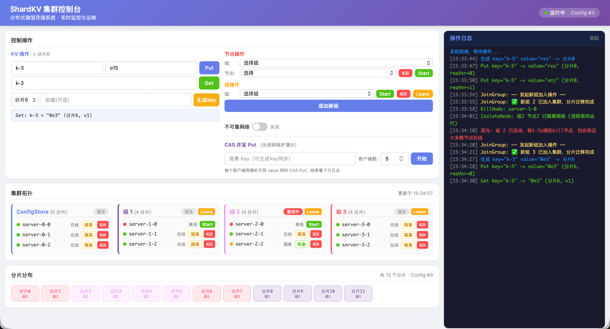

# Distributed KV Store

基于 Raft 共识算法的高可用、强一致、可水平扩展的分布式分片键值存储系统。

> **核心特性：** 每个 Raft 节点运行在独立 OS 进程中，通过 Unix 域套接字通信，在单机上模拟真实分布式环境。配合 Web 控制面板，可视化演示键值读写，分片组加入/离开、故障注入、分片迁移等场景。

---

## 快速开始


### 方式一：使用 Docker 启动

```bash
# 构建镜像
make docker

# 启动容器（访问 http://localhost:8080）
make run
```

### 方式二：本地启动
#### 前置条件

- Go 1.22+
- Unix-like 操作系统（macOS / Linux）

```bash
cd shardkv-demo
make run
```

浏览器打开 `http://localhost:8080`，`Ctrl+C` 停止。

#### 运行测试

```bash
cd src
make shardkv          # 全部 ShardKV 测试
make raft             # Raft 测试
make RUN="-run TestJoinBasic5A" shardkv  # 单个用例
```
---

## 主要特性

| 特性            | 说明                                             |
|---------------|------------------------------------------------|
| **Raft 共识算法** | 完整的 Leader 选举、日志复制、冲突回退（快速回退优化）、日志压缩与快照安装      |
| **线性一致性键值读写** | 基于版本号的条件更新（CAS），客户端请求去重，保证线性一致性                |
| **数据分片**      | FNV-1a 哈希分片，支持动态分片组 加入/离开                      |
| **分片迁移**   | 迁移过程保证数据一致性和幂等性      |
| **双配置机制**     | currentConfig / nextConfig + CAS 写入，支持多控制器安全并发 |
| **Web 控制面板**  | 实时拓扑展示、节点故障注入、网络分区模拟、CAS 并发写入演示                |
| **故障恢复**      | 全部节点崩溃重启后数据不丢失，未完成迁移可自动恢复                      |
| **线性一致性检验**   | 集成 Porcupine 验证器，测试中自动校验操作历史                   |

---

## 项目结构

```
├── src/                      # 核心源码
│   ├── raft/                 # Raft 共识算法实现
│   │   ├── raft.go           #   核心状态机
│   │   ├── proxy.go          #   RPC 代理
│   │   └── ...
│   ├── kvraft/               # 基于 Raft 的 KV 服务（配置仓库）
│   │   └── rsm/              #   复制状态机中间层
│   ├── kvsrv/                # 单节点 KV 服务
│   ├── shardkv/              # 分片 KV 存储
│   │   ├── shardcfg/         #   分片配置定义
│   │   ├── shardctrler/      #   分片控制器
│   │   └── shardgrp/         #   分片组服务器
│   ├── tester/               # 分布式测试框架
│   ├── kvtest/               # KV 一致性检验器
│   ├── rpc/                  # 通用 RPC 框架
│   └── main/                 # 可执行程序入口
├── shardkv-demo/             # Web 演示控制台
│   ├── cluster/              #   集群管理器
│   └── web/                  #   HTTP 服务 + 前端
├── Dockerfile                # 多阶段 Docker 构建
├── Makefile                  # 根目录构建脚本
└── docs/                     # 设计文档
    ├── ARCHITECTURE.md       #   整体架构
    ├── DESIGN.md             #   详细设计
    ├── API.md                #   接口文档
    └── TESTING.md            #   测试覆盖说明
    
```

---

## 技术文档

| 文档                                      | 内容                         |
|-----------------------------------------|----------------------------|
| [ARCHITECTURE.md](docs/ARCHITECTURE.md) | 系统架构、分层设计、模块职责             |
| [DESIGN.md](docs/DESIGN.md)             | 详细设计决策详解（Raft、去重、CAS、迁移协议） |
| [API.md](docs/API.md)                   | RPC 接口定义、错误码语义             |
| [TESTING.md](docs/TESTING.md)           | 73 个测试的详细说明与覆盖分析           |

---

## 控制面板使用说明

浏览器打开 `http://localhost:8080` 即可访问控制面板。界面由以下几个功能区组成：



### KV 读写操作

| 操作 | 说明 |
|------|------|
| **Put** | 输入 Key / Value，点击 `Put` 写入键值对 |
| **Get** | 输入 Key，点击 `Get` 读取对应值 |
| **生成 Key** | 选择一个目标分片，自动生成映射到该分片的 Key，并填入随机 Value |

操作结果会实时显示在下方的结果区域，并记录到右侧操作日志。

### 节点操作

选择组和节点后，可对单个节点执行以下操作：

| 操作 | 说明 |
|------|------|
| **Kill** | 杀死节点进程，模拟节点宕机 |
| **Start** | 重新启动已宕机的节点，节点会自动连入集群并同步数据 |

### 组操作

| 操作 | 说明 |
|------|------|
| **添加新组** | 创建一个新的分片组（3 个节点）并加入集群，触发分片自动迁移 |
| **Start** | 启动组内全部 3 个节点 |
| **Kill** | 杀死组内全部 3 个节点 |
| **Leave** | 让组离开集群，分片将自动迁移至其他组 |


### 网络可靠性开关

开启 **不可靠网络** 后，集群中的 RPC 通信会模拟真实网络环境：

- **丢包率：** 10%
- **随机延迟：** 27~7000 ms 

适用于测试系统在网络故障下的容错能力 

（注：可以通过修改 [rpc 包](src/rpc/rpc.go) `DROPRATE`, `SHORTDELAY`,`LONGDELAY`来改变丢包率和延迟)

### CAS 并发竞赛

演示基于版本号的乐观锁（CAS，Compare-And-Swap）机制：

1. 输入一个竞赛 Key
2. 设置并发客户端数（1~20）
3. 点击 **开始** — 所有客户端同时对该 Key 发起 CAS Put 操作


### 集群拓扑面板

可视化展示所有分片组及其节点状态：

- **节点状态指示灯：** 🟢 在线 · 🟡 网络隔离 · 🔴 离线
- **行内快捷操作：** 每个节点可直接 `隔离` / `恢复` / `Kill` / `Start`
- **混沌猴子：** 点击组标题旁的 `混沌` 按钮，启动自动故障注入 — 系统每 1~3 秒随机杀死一个节点，同时保证大多数节点在线，用于长时间压力测试
- **分片迁移提示：** 当有未完成的分片迁移时，拓扑标题旁会显示 ⚠ 提示，点击可尝试恢复

### 分片分布面板

展示 12 个分片到各分片组的映射关系，每个分片用对应组的颜色标识，直观反映分片布局的变化。

### 操作日志面板

右侧日志面板实时输出所有操作的详细记录，包括：

- Key/Value 读写结果
- 节点启停和网络状态变化
- 分片迁移过程
- CAS 竞赛的并发请求结果

日志支持自动滚动，保留最近 200 条记录，点击标题栏可收起/展开。

---

## 致谢

本项目基于 [MIT 6.5840 Distributed Systems](https://pdos.csail.mit.edu/6.824/) 课程实验框架开发。

## 相关资源

- [Raft 论文](https://raft.github.io/raft.pdf)
- [Porcupine 线性一致性检验器](https://github.com/anishathalye/porcupine)
- [MIT 6.5840 Distributed Systems](https://pdos.csail.mit.edu/6.824/)
- [本人最初使用仓库](https://github.com/AOisUsed/mitDistroSys25) - 包含 Raft, KVRaft, MapReduce等模块的开发历史。
