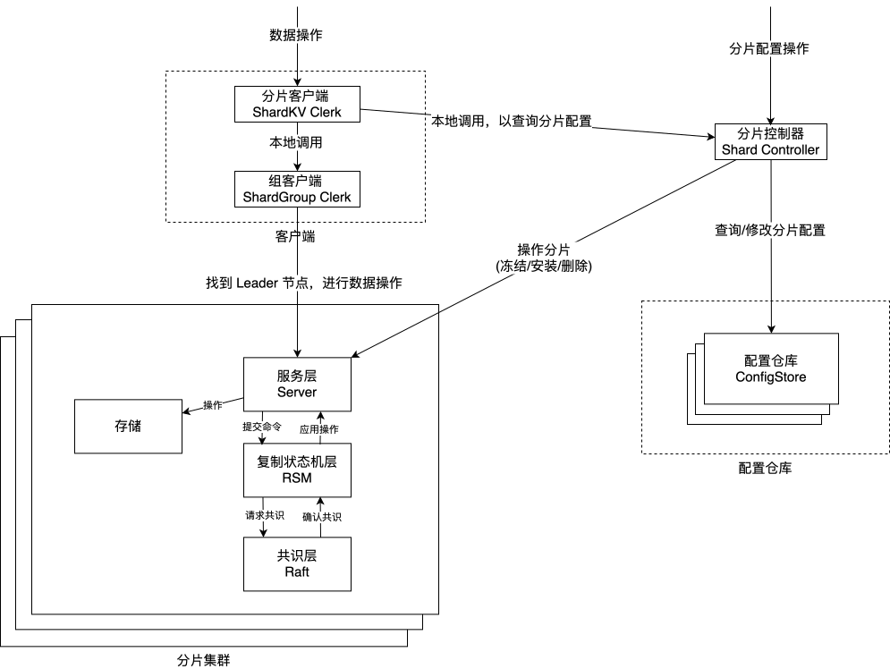
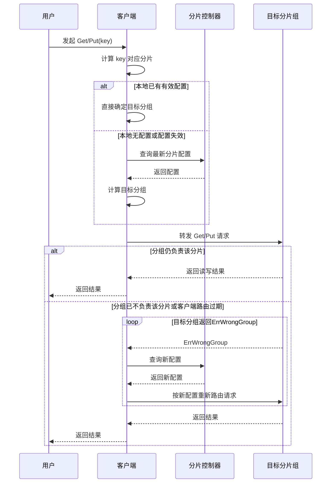
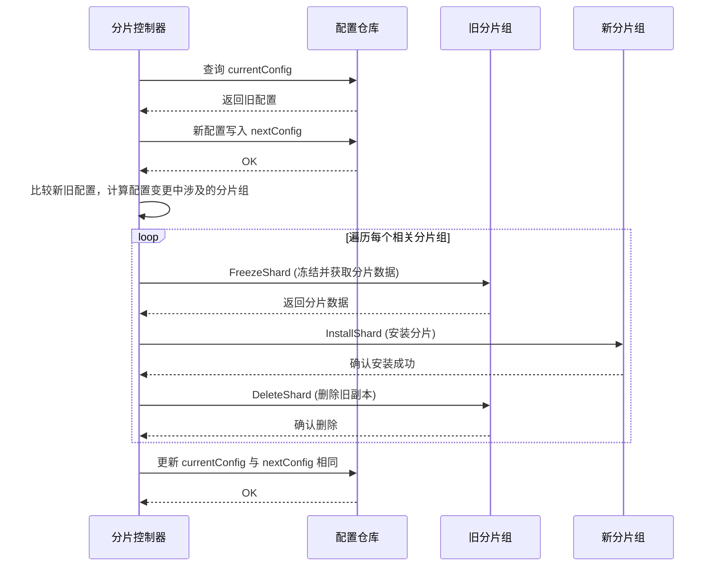

# 系统架构

> **目录**
>
> - [总体架构](#总体架构)
>   - [客户端](#客户端)
>   - [分片集群](#分片集群)
>   - [配置仓库](#配置仓库)
>   - [分片控制器](#分片控制器)
> - [核心模块职责](#核心模块职责)
>   - [客户端](#客户端)
>   - [分片集群（内部三层）](#分片集群内部三层)
>     - [1. 共识层 — Raft](#1-共识层--raft)
>     - [2. 复制状态机中间层 — RSM](#2-复制状态机中间层--rsm)
>     - [3. 服务层 — Server](#3-服务层--server)
>   - [配置仓库 — ConfigStore](#配置仓库--configstore)
>   - [分片控制器 — Shard Controller](#分片控制器--shard-controller)
> - [关键流程](#关键流程)
>   - [键值读写流程](#键值读写流程)
>   - [分片迁移流程](#分片迁移流程)

## 总体架构

系统由四类组件构成：客户端、分片集群、配置仓库与分片控制器。


### 客户端

客户端由两级 Clerk 构成，实现请求的二层路由：

- **ShardKV Clerk**: 面向用户的统一入口。收到 Get/Put 请求后，计算分片、查询配置缓存、确定目标分片组。
- **ShardGroup Clerk**: 面向分片组的通信代理。在组内轮询找到 Leader 节点，发送请求。

```
     用户请求 
        ↓
ShardKV Clerk (计算分片 → 确定目标组)
        ↓
ShardGroup Clerk (组内轮询找 Leader)
        ↓
 目标 Raft 领导者节点
```

ShardKV Clerk 持有分片控制器的引用用于查询配置。客户端通过两级路由让服务端的分片以及分片组多节点对用户透明，使用体验如同一个单机的键值存储系统。

### 分片集群

分片集群由多个分片组构成，每组内部通过 Raft 协议维护一致性，接受键值读写、分片迁移操作。

### 配置仓库

配置仓库是一个使用 Raft 维护一致性的持久化键值存储集群，存放当前分片配置 (currentConfig) 与下一分片配置 (nextConfig). 分片控制器通过它实现分片配置的持久化，多个分片控制器间的协调。

### 分片控制器

分片控制器负责管理分片配置和编排分片迁移。它通过配置仓库的 CAS 写入协调配置变更，调用分片组的冻结/安装/删除接口迁移数据。ShardKV Clerk 持有它的引用用于查询配置。


## 核心模块职责

### 客户端

#### ShardKV Clerk

**职责：** 面向用户的统一入口，负责请求路由和配置管理。

| 功能    | 说明                                       |
|-------|------------------------------------------|
| 分片计算  | 对 key 做哈希计算所属分片                          |
| 配置缓存  | 本地缓存分片配置，按需刷新                            |
| 查询配置  | 采用单飞模式 (single-flight) ，多请求并发时只有一个查询配置仓库 |
| 跨组重路由 | 配置过期时自动重新查询并路由                           |

#### ShardGroup Clerk

**职责：** 向目标分片组发送请求，在组内轮询寻找 Leader。

| 功能   | 说明                                     |
|------|----------------------------------------|
| 组内重试 | 轮询分片组内所有节点，遇到 ErrWrongLeader 自动切换节点重试  |
| 快速失败 | 组内所有节点尝试一定次数后，返回失败给上层 ShardKV Clerk 处理 |

---

### 分片集群（内部三层）

#### 1. 共识层 — Raft

**职责：** 实现 Raft 共识算法，为上层提供强一致性日志复制服务。

| 子模块   | 功能                                         |
|-------|--------------------------------------------|
| 领导者选举 | 基于随机超时的选举机制，保证任意任期最多一个 Leader              |
| 日志复制  | 通过 AppendEntries RPC 并行复制到所有 Follower      |
| 冲突回退  | 快速回退优化（跳过整个冲突任期），减少 RPC 往返次数               |
| 提交推进  | 追踪多数派复制进度，安全推进 commitIndex                 |
| 日志压缩  | 快照机制减少日志存储，支持 InstallSnapshot RPC 追赶       |
| 持久化   | 关键状态（Term、VotedFor、Log、Snapshot）持久化，支持崩溃恢复 |

#### 2. 复制状态机中间层 — RSM

**职责：** 连接共识层与服务层，屏蔽 Raft 细节。

| 功能   | 说明                                |
|------|-----------------------------------|
| 请求封装 | 将业务请求封装为 `Op{Me, Id, Req}` 提交到共识层 |
| 等待结果 | 三路等待业务处理结果：共识完成 / 领导权丢失 / 节点关闭    |
| 快照管理 | 日志超阈值时触发快照，故障时从快照恢复               |
| 错误语义 | 领导权变化时返回 ErrWrongLeader，由客户端重试    |

#### 3. 服务层 — Server

**职责：** 实现键值存储业务逻辑和分片迁移控制。

| 功能     | 说明                                                 |
|--------|----------------------------------------------------|
| 版本化读写  | 每个键维护版本号，CAS 语义写入                                  |
| 客户端去重  | 记录每个客户端最近一次写请求，防止重试导致重复执行                          |
| 分片状态管理 | 记录分片三类状态：Absent / Serving / Frozen                 |
| 分片迁移处理 | 处理 FreezeShard / InstallShard / DeleteShard 三类 RPC |
| 快照与恢复  | 键值数据 + 去重元数据 + 分片元数据统一快照                           |

---

### 配置仓库 — ConfigStore

**职责：** 存放分片配置的持久化键值存储。

| 功能    | 说明                                                 |
|-------|----------------------------------------------------|
| 配置存储  | 使用 currentConfig / nextConfig 双配置机制, 使用版本号进行并发写入控制 |
| 一致性保障 | 内部由 Raft 保证配置数据的一致性和持久性                            |

---

### 分片控制器 — Shard Controller

**职责：** 管理分片配置，编排分片迁移。

| 功能     | 说明                       |
|--------|--------------------------|
| 配置初始化  | 首次启动时写入初始配置              |
| 配置变更   | 分片组 加入/离开 时平衡分片负载并进行分片迁移 |
| 多控制器竞争 | CAS + 配置号保证只有一个控制器执行变更   |
| 故障恢复   | 启动时检测未完成迁移，自动恢复          |

---

## 关键流程

### 键值读写流程




### 分片迁移流程

> 注：从可读性考虑，仅包含正常执行流程，异常情况处理和幂等操作设计详见 [分片迁移](DESIGN.md)


