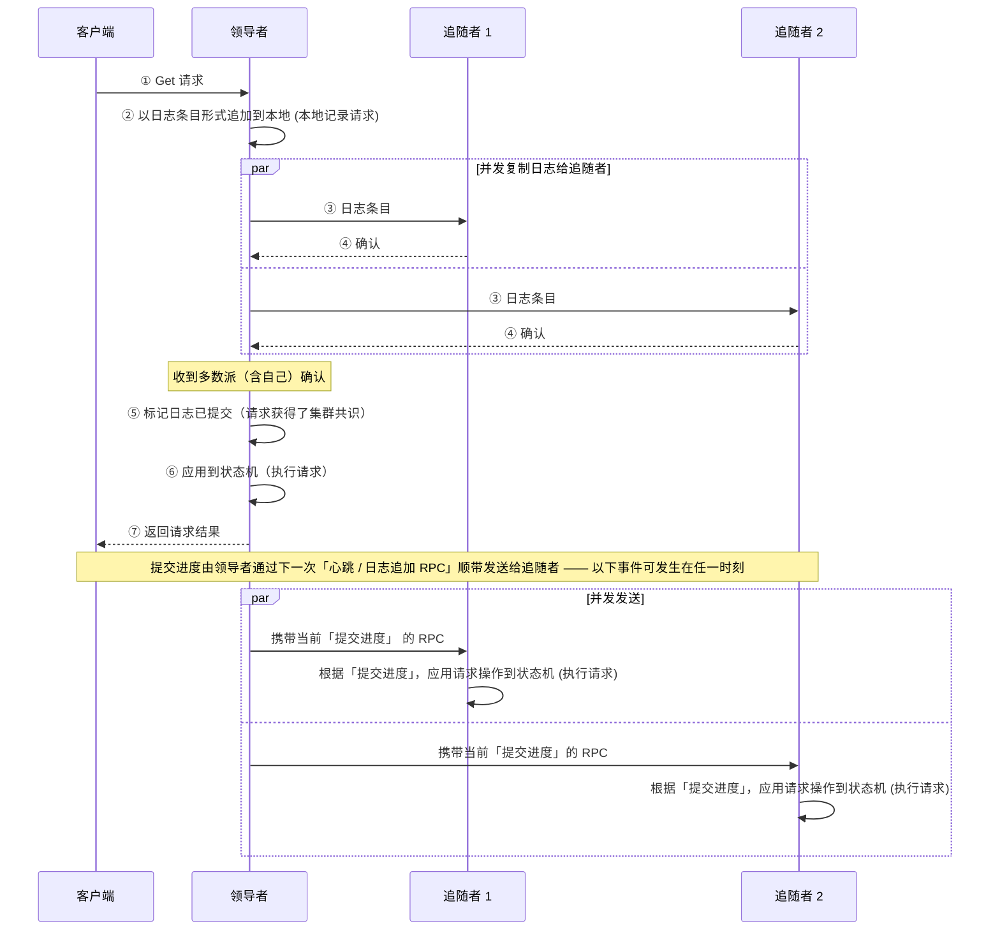
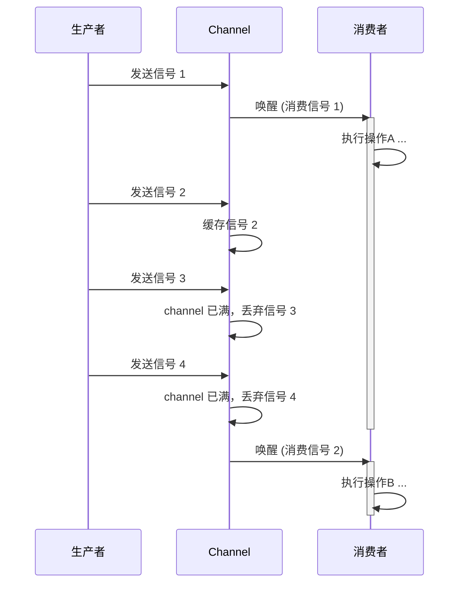
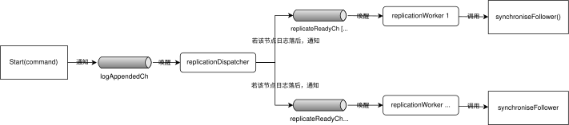

# 详细设计

## Raft 共识算法实现
具体实现：[raft.go](../src/raft/raft.go)
> 📖 **阅读建议：** 推荐按 "先建立直觉、再查细节、看不懂先跳" 的方式阅读。
> - 先读「Raft 速览」建立整体印象；
> - 「核心数据结构」和各种表格不必详读，后续机制涉及到其中字段时查阅即可；
> - 机制小节（选举 / 复制 / 提交 / 快照 / 恢复）可按顺序读，也可按需跳读。

### Raft 速览

> 💡 **提示：** 此小节是对 Raft 的最简介绍，算法细节可参考 [Raft 论文中文翻译](RAFT_PAPER_ZH.md)，或访问 [Raft 官网](https://raft.github.io)（包含一个可交互演示）

Raft 解决一个问题：在分布式系统中，多个节点如何对命令的操作顺序达成一致，使其对外看起来像一台单机，即使面临网络延迟、分区和节点故障。

核心思路：**赋予服务器节点角色和相应的行为模式 —— 在所有节点选出一个领导者，所有客户端请求都经由领导者转送给其他节点 (追随者) 确认；待大多数节点都确认后，领导者就执行请求，并通知其他节点也执行请求；最后领导者将请求结果返回该给客户端。** 

下面用一次 `Get` 请求的共识流程，以帮助建立直观印象（图中以 3 节点集群为例，多数派 = 2）：



围绕核心思路，Raft 工程实现至少需要如下模块：
- **领导者维持**（保证唯一有效领导）：
  - **心跳**：领导者通过周期性广播维持领导权，阻止新选举。
  - **选举**：节点察觉领导者失效后，发起选举以选出新领导者。
- **请求共识**（保证全节点操作一致）：
  1. **日志复制**：领导者将客户端请求按顺序复制给所有节点。
  2. **日志提交**：领导者依据多数派确认，推进提交进度(即共识进度)并同步给跟随者。
  3. **日志应用**：所有节点将已提交日志顺序应用到状态机。

后续小节会分别展开这些主题并详细说明。

### 核心数据结构

Raft 节点的核心状态包括角色、任期、日志和投票信息等字段，并通过 `RequestVote`、`AppendEntries` 和 `InstallSnapshot` 三种 RPC 实现节点间通信（详见 [Raft 内部 RPC](API.md#raft-内部-rpc)）。

**持久化状态**（每次修改需持久化，否则崩溃重启后会丢失，产生数据一致性问题或集群脑裂）：

| 字段                  | 类型           | 说明                            |
|---------------------|--------------|-------------------------------|
| `CurrentTerm`       | `int`        | 节点当前已知的最新任期，防止同一任期重复投票        |
| `VotedFor`          | `int`        | 当前任期已投票的候选者编号，-1 表示未投票        |
| `Log[]`             | `[]LogEntry` | 日志数组，每个条目包含 Term 和 Command    |
| `LastIncludedIndex` | `int`        | 快照中包含的最大日志索引（日志压缩后日志数组的起始偏移量） |
| `SnapshotData`      | `[]byte`     | 快照数据（日志压缩时保存的状态机状态）           |

**易失状态**（可恢复，无需持久化）：

| 角色    | 字段             | 类型      | 说明                                   |
|-------|----------------|---------|--------------------------------------|
| 所有节点  | `commitIndex`  | `int`   | 已提交的最大日志索引（多数派已确认）                   |
|       | `lastApplied`  | `int`   | 已应用到状态机的最大日志索引                       |
|       | `state`        | `enum`  | 节点当前角色：Follower / Candidate / Leader |
| 领导者节点 | `nextIndex[]`  | `[]int` | 下一次要发送给各追随者的日志索引                      |
|       | `matchIndex[]` | `[]int` | 已知已复制到各追随者的最高的日志索引                    |

**功能性字段**（无需持久化）：

| 字段                  | 类型                | 说明                                                                                                    |
|---------------------|-------------------|-------------------------------------------------------------------------------------------------------|
| `applyCh`           | `chan ApplyMsg`   | Raft对日志共识后通过此 channel 将命令传递给上层 RSM 以应用在状态机上                                                           |
| `lastHeardTime`     | `time.Time`       | 收到的最近一次有效 RPC 时间，用于选举超时判定                                                                             |
| `logAppendedCh`     | `chan struct{}`   | 容量为 1，用于通知`replicationDispatcher`协程：本地 Raft 有日志追加                                                     |
| `applyReadyCh`      | `chan struct{}`   | 容量为 1，用于通知`applier`协程：有新的日志 / 快照可应用到状态机上                                                              |
| `replicateReadyChs` | `[]chan struct{}` | 各 channel 容量均为 1，用于通知`replicationWorker`协程：需要向 Follower 发送`AppendEntries RPC` 或 `InstallSnapshot RPC` |
| `snapshotPending`   | `bool`            | 标记是否有快照需要应用到状态机上：在同时有快照和日志的情况下，`applier`将优先应用快照                                                       |

### 并发架构

根据 [Raft 速览](#raft-速览) 中所述模块划分，本系统将共识机制拆解为多个常驻协程协同实现。

Raft 节点启动后创建 5 类常驻协程，协程间通过 channel 非阻塞式异步通信。各协程职责如下：

| 所属模块  | 协程                    | 数量      | 职责                                 | 触发方式                     |
|-------|-----------------------|---------|------------------------------------|--------------------------|
| 领导者维持 | ticker                | 1       | 选举超时检测，并发起选举                       | 定时自动触发 (300ms-600ms间随机数) |
| 领导者维持 | sendHeartbeat         | 1       | 定期广播心跳维持领导权                        | 定时自动触发 (每100ms)          |
| 命令共识  | replicationDispatcher | 1       | 在追随者日志落后情况下唤醒对应 replicationWorker  | 收到`logAppendedCh` 信号     |
| 命令共识  | replicationWorker     | 节点数 - 1 | 向对应的追随者发送日志或快照                     | 收到`replicateReadyCh` 信号  |
| 命令共识  | applier               | 1       | 将已提交日志 / 快照发送到`applyCh`, 驱动状态机应用操作 | 收到`applyReadyCh` 信号      |

#### 时间驱动 + 事件驱动混合并发模型


- 选举超时、心跳机制各自独立运行，以实现 **领导者维持**：
	- 领导者节点上，`sendHeartbeat` 每 100ms 广播一次心跳以维持领导权
	- 非领导者节点上，`ticker` 每隔 300-600ms 间随机时长检查是否期间收到领导者心跳，未收到就重新选举
- 其余协程则按照「日志复制→日志提交→日志应用」的流程协同实现 **请求共识**：
	1. 领导者节点上层收到客户端请求后包装为日志，追加到本地，并唤醒`replicateDispatcher` 分发日志给追随者
	2. `replicateDispatcher` 被唤醒后，观察所有追随者节点日志的状况，如果节点日志落后于自身，则并发唤醒对应的 `replicateWorker` 以RPC形式发送日志给落后节点
	3. RPC 返回时，观察日志是否获得多数派确认。如果是，则说明日志条目获得了集群共识，通知 `applier` 将日志中的命令投递给状态机

> 🌟 **设计决策**：
> - **异步推进共识流程**：共识流程是线性的，理论上可以使用同步调用实现。但由于流程涉及网络通信、消息重传、文件I/O、状态机应用等耗时操作，在工程层面上，同步调用实现的系统是完全不可用的。因此系统使用了协程和异步通信来保证高效运转，协程也尽量保证单一职责，协程间低耦合。
> - **协程生命周期管理**：常驻协程生命周期和节点进程绑定，与节点角色无关。若采用"角色强绑定"风格——成为领导者才创建需要的协程、退位即销毁——反而会因角色更替频繁创建/销毁协程，增加管理复杂度且易泄漏。另一方面，由于共识相关协程采用事件驱动，`replicationDispatcher` 与 `replicationWorker` 在追随者节点上长期阻塞、无 CPU 占用，常驻并不产生额外性能开销。
> - **集中调度 + 独立 worker 协程**：由 `replicationDispatcher` 统一接收信号、判定哪些追随者落后，再精准唤醒对应 worker，是为了集中决策、分散执行，也能解耦了"本地日志追加"与"日志复制"两个子模块；针对每个追随者使用独立的 `replicationWorker`，可按各节点进度并发发送 RPC，落后节点不会阻塞其他节点的复制进度。
> - **单一 applier 协程**：状态应用必须严格按日志顺序串行执行，并发应用会破坏线性一致性，因此使用单一协程执行。
> - **单一粗粒度锁**：所有共享状态共用一把互斥锁，未细分锁，可以降低死锁风险，减轻使用时的心智负担，代价是可能降低并发度。临界区中大部分操作 (状态读写，少量计算，发送信号) 都极快，只有唯一的慢操作「状态持久化」—— 须在锁内持久化 [Raft 状态](#核心数据结构) ，在日志过长的情况下耗时显著；但由于本系统实现了快照机制，可以控制日志长度上限，进而限制持久化耗时。因此相比细粒度锁，使用粗粒度锁性能损失极小，综合来说是更好的选择。

在此模型之上，协程间信号传递采用了一套统一的通信模式，下文展开说明。

#### 协程间异步通信

协程间通过 channel 异步通信，表达 「有任务待完成」 语义：
``` go
    // channel 定义：
    ch := make(chan struct{}, 1) // 最多积压一个信号
```

消息生产者：
``` go
    // 生产者：非阻塞式发送信号，满则丢弃
    select{
    case ch <- struct{}{}:
    default:
    }
```

消息消费者：
``` go
    // 消费者：持续监听信号，并依据当前 Raft 状态执行操作
    for {
        <- ch
        doWork() // 执行具体(耗时)操作，不同消费者执行内容各异
    }
```

以下以时序图来解释通信机制和实现的效果：



图中信号2、3、4 被压缩为一个信号，因为这些信号传递的语义是相同的 —— 「有任务待完成」；消费者完成当前任务后被唤醒，自行决定行为。

> 🌟 **设计决策**：
> 此设计未使用经典「生产者-消费者」模型，以 channel 来传递具体任务，主要考虑有两点：
> 1. **任务有强实效性**。设想一种场景：上游以领导者角色在本地追加了日志并通知下游；一段时间后，下游协程被唤醒，此时角色已不是领导者。若按照任务内容执行，给其他节点发送日志，将会被拒绝，产生不必要的网络通信。
> 2. **具体任务可以通过 Raft 状态机推导获得，使用 channel 来传递是冗余，且可能造成不一致**。以日志 RPC 为例，`nextIndex[]` 字段记录了下一次应该发送的日志的索引，发送日志的 worker 访问该字段即可推导出任务内容。
> 
> 因此，本实现的并发哲学是 **共享内存为主、channel 为辅**：协程之间通过 channel 只传递「有任务待完成」的触发信号；任务内容则由协程被唤醒时 Raft 的状态来决定。

以上搭建了共识机制的并发骨架：5 类常驻协程通过 channel 信号协同推进「日志复制 → 日志提交 → 日志应用」的共识流程。下文将按此流程顺序逐一展开各机制的实现细节，每一节对应上述某类协程的具体行为：
- **领导选举与心跳**：`ticker` 与 `sendHeartbeat` 如何维持领导权、超时触发选举；
- **日志复制**：`replicationDispatcher` / `replicationWorker` 如何向追随者同步日志；
- **提交推进与状态应用**：如何判定多数派确认并提交、交给 `applier` 应用；
- **快照安装** / **故障恢复**：日志压缩与节点重启后的状态重建。

### 领导选举与心跳

选举模块负责在集群启动或者领导者失效时，选举出一个新的领导者。其核心目标是保证任意任期内最多只有一个领导者，且经过有限轮投票后必能选出领导者。

#### 选举触发

常驻的 `ticker` 协程，会定时检查是否需要触发选举：

```pseudocode
// 触发选举 (ticker)

ticker(){
    循环执行 {
        electionTimeout = 300-600 ms
        if 当前为follower/candidate 且 lastHeardTime-当前时间 > electionTimeout { 
            startElection()
        }
        休眠 electionTimeout
    }
}
```
- **随机超时范围 (300-600ms)**：避免多个节点同时检测到超时，发起选举，并平票导致无法迅速选出领导者。
- **超时判定依据 `lastHeardTime`**：节点收到有效的 RPC 时或发起选举时更新此时间戳，因此只有长时间未与有效领导者通信的节点才会触发选举。

> 🌟 **设计决策**：
> 超时上下限的设置与心跳间隔、网络状况密切相关。这里设为3-6倍心跳间隔，最低只可容忍连续2-3次心跳丢失，前提假设是网络状况较好，故障原因集中在机器宕机；使用低超时以追求更快的故障恢复。网络状况较差时应增大超时时间以保证领导权的稳定性，代价是更慢的故障恢复。

#### 发起选举

节点之间通过 [RequestVote RPC](API.md#requestvote) 来沟通——候选者向其他节点请求投票，携带任期与日志进度（`LastLogIndex` / `LastLogTerm`），回复是否同意（`VoteGranted`）。

当 `ticker` 检测到超时后，调用 `startElection()` 发起选举：

```pseudocode
// 发起选举 (startElection)

startElection() {
    // 1. 自增当前任期，转换为候选者身份
    CurrentTerm++, state = candidate, VotedFor = me, lastHeardTime = 当前时间
    persist()

    // 2. 构造投票请求，携带自己的日志信息
    构造 args = RequestVoteArgs{
        Term:         CurrentTerm,
        CandidateId:  me,
        LastLogIndex: lastLogIndex(),
        LastLogTerm:  lastLogTerm(),
    }

    // 3. 先投自己一票
    voteCount = 1

    // 4. 向其他所有节点并发发送投票请求
    对除自己外所有节点，并发执行 {
        reply = sendRequestVote(args)

        if 发送失败 { return }

        if reply.Term > CurrentTerm {
            转为follower, 更新lastHeardTime, persist()
            return
        }

        if reply.VoteGranted && state == candidate && 任期未变 {
            voteCount++
            if voteCount > N/2 {
                state = leader
                nextIndex[] 都重置为 lastLogIndex() + 1
                matchIndex[] 都重置为 0
            }
        }
    }
}
```

设计要点：

| 步骤                     | 说明                                        |
|------------------------|-------------------------------------------|
| 先 `persist()` 再发 RPC   | 确保节点崩溃重启后不会忘记自己发起了选举，在一轮中多次投票             |
| 携带 `LastLogIndex/Term` | 保证当选者包含全部已提交日志                            |
| 并发发送 RPC               | 减少选举耗时，避免在选举期间错过下一轮心跳                     |
| 收到更高任期立即降级             | 防止多个任期分裂，保证任期单调递增                         |
| 收到过半节点投票即变为领导者         | 容忍少数节点宕机时仍能选出领导者                          |

#### 应对投票请求

节点收到 `RequestVote RPC` 后，按以下顺序判定是否投票：

```pseudocode
// 投票请求处理 (RequestVote)

RequestVote(args, reply) {
    // 1. 任期判定：收到更高任期则立即降级
    if args.Term > CurrentTerm { 转为follower }

    // 2. 投票三条件（任期足够 且 未投票 且 日志不旧于自己）
    if args.Term >= CurrentTerm
       && (VotedFor == -1 || VotedFor == args.CandidateId)
       && (args.LastLogTerm > lastLogTerm()
           || (args.LastLogTerm == lastLogTerm() && args.LastLogIndex >= lastLogIndex())) {
        reply.VoteGranted = true
        lastHeardTime = 当前时间
        VotedFor = args.CandidateId
        state = follower
    } else {
        reply.Term = CurrentTerm
        reply.VoteGranted = false
    }
    persist()
}
```

投票三条件含义：

| 条件                                                 | 说明                        |
|----------------------------------------------------|---------------------------|
| `args.Term >= CurrentTerm`                         | 不能给任期更低的候选者投票（防止过期节点重新当选） |
| `VotedFor == -1 \|\| VotedFor == args.CandidateId` | 同一任期内只投一票，防止脑裂            |
| 候选者日志不旧于自己                                         | 日志最新的节点才能当选，保证已提交日志不丢失    |

日志比较规则（条件 3 的展开）：

1. 先比较**最后一条日志的 Term**：任期更大的日志更新
2. Term 相同时比较**最后一条日志的 Index**：Index 更大的日志更新

此规则确保：若某节点拥有已提交的日志，它不会投票给**不包含该日志**的候选者，从而保证已提交日志永远不丢失。

#### 心跳维持

领导者当选后需定期发送心跳以维持领导权，防止追随者超时触发新一轮选举：

```pseudocode
// 心跳 (sendHeartbeat)

sendHeartbeat() {
    循环执行 {
        if 当前是leader {
            对除自己外所有节点 并发执行 replicateToFollower()
        }
        休眠 100ms
    }
}
```

心跳在 Raft 中的作用：

| 作用     | 说明                                                                       |
|--------|--------------------------------------------------------------------------|
| 宣告领导权  | 追随者收到心跳后更新 `lastHeardTime`，重置选举超时                                        |
| 携带提交信息 | 心跳中携带 `LeaderCommit`，追随者据此推进自己的 `commitIndex`（详见[提交推进与状态应用](#提交推进与状态应用)） |

100ms 间隔的选择依据：远小于选举超时下限（300ms），即使网络有轻微抖动，追随者也能连续收到至少 2-3 次心跳才会超时，有效防止误触发选举。

当心跳 RPC 发现追随者日志落后时（`nextIndex[i] <= lastLogIndex()`），`replicateToFollower()` 会使用携带日志条目的 [AppendEntries RPC](API.md#appendentries)（携带 `PrevLogIndex` / `PrevLogTerm` 做一致性检查、`LeaderCommit` 推进提交）或带有状态机快照的 [InstallSnapshot RPC](API.md#installsnapshot)（向日志过短的追随者发送完整快照以快速追上），以保证在维持心跳的同时完成日志同步（详见[日志冲突快速回退](#日志冲突快速回退)）。

### 日志复制
领导者通过日志复制将上层命令分发给所有追随者，以作为后续共识的基础
#### 整体流程
日志复制从上层 RSM 调用 `Start(command)` 开始，逐步推进，完成目标是 Follower 日志与 Leader 完全一致。

1. `Start(command)` 本地追加日志

#### 冲突回退
针对 Raft 论文中逐条回退的低效问题，实现了三种冲突情况的优化。核心思路是每次回复携带足够信息，使领导者一次回退跳过整个冲突任期，而非逐条尝试：

| 冲突类型 | 追随者回复 | 领导者处理 |
|---------|-----------|-----------|
| PrevLogIndex 处 Term 不匹配 | `ConflictTerm=T, ConflictIndex=该任期第一条索引` | 跳到领导者日志中 ConflictTerm 最后一条的后一个位置 |
| 追随者日志过短 | `ConflictTerm=-1, ConflictIndex=LastLogIndex+1` | nextIndex = ConflictIndex |
| 日志已被压缩 | `ConflictTerm=-1, ConflictIndex=LastIncludedIndex+1` | nextIndex = ConflictIndex → 触发 InstallSnapshot |

第二、三种冲突实质都是领导者声明的 PrevLogIndex 处日志在追随者中不存在，无法分辨 Term 是否匹配。追随者通过合理的 RPC 回复引导领导者将这些不确定性冲突转化为可判断的第一种冲突，通过实证找到冲突点。

日志压缩可能导致冲突回退无法使用 AppendEntries 解决（领导者需要发送的日志已被截断），此时转为发送 InstallSnapshot。

### 提交推进与状态应用

**提交推进**：

不同角色推进 commitIndex 的方式不同：

- **领导者**：为每个追随者维护 matchIndex[i]，追踪各节点的复制进度。某次 AppendEntries RPC 成功后，更新 matchIndex[i]，然后从后向前扫描日志，找到满足以下三个条件的最大索引 N：
  1. N > 当前 commitIndex
  2. Log[N].Term == CurrentTerm（仅提交当前任期的日志，防止提交已覆盖的旧任期条目）
  3. 超过半数的节点 matchIndex[i] >= N（多数派已复制）
  若找到，则 commitIndex = N。

- **追随者**：每次收到 AppendEntries RPC 时读取 LeaderCommit，若大于自身 commitIndex，则尽最大可能推进。收到 InstallSnapshot 时同样检查快照的 LastIncludedIndex。

**状态应用**：

由独立的 applier 协程串行完成。该协程收到 commitIndex 更新的通知后，从 lastApplied + 1 开始，顺序将日志中的命令通过 applyCh 通道发送给状态机层执行，直到处理完所有已提交命令。

**提交与应用分离的好处**：两阶段异步运行，若状态机层因卡顿无法及时应用请求，下层的 Raft 共识层仍能继续推进日志共识，互不影响。

### 快照安装

- 单次 RPC 传输完整快照（非论文的分块传输），简化实现，接收方无需维护多个"接受中"状态
- 接收方需区分"日志截断"和"状态机更新"两个判断维度：
  - **日志判断**：快照包含本地日志时，若快照中最后一条日志与本地匹配则截断，否则丢弃全部本地日志
  - **状态机判断**：快照可能比本地状态机进度旧 → 不应用；比本地状态机进度新 → 应用，否则保持现状

### 故障恢复

需要持久化的内容分为两类：一是保证系统正确性的数据（CurrentTerm、VotedFor、Log），二是保证节点崩溃后快速恢复的数据（LastIncludedIndex、SnapshotData）。

节点启动时调用 readPersist() 从持久器中读取这些状态并恢复，使节点能够继续参与集群，无需从头开始同步。

### 延伸阅读

- **Raft 论文中文版**（[RAFT_PAPER_ZH.md](RAFT_PAPER_ZH.md)）：想看形式化定义、安全性证明与完整机制再读，尤其是 [第五章](RAFT_PAPER_ZH.md#5-raft-共识算法)。本文档的速览已覆盖阅读本设计所需的最小知识。
- **可视化 Raft**（https://raft.github.io）：交互式动画，直观感受选举与日志复制过程。

---

## 复制状态机中间层（RSM）

参考实现：[rsm.go](../src/kvraft/rsm/rsm.go)

### 职责与位置

RSM 位于 [Raft 共识层](API.md#raft-共识模块接口)与[服务层](API.md#实现-statemachine-接口-rsm-使用)之间，承担关键的中介职责：

1. 将服务层的业务请求封装为 `Op{Me, Id, Req}` 结构，提交到 Raft 共识层
2. 等待共识结果，将已共识的命令交付服务层执行，结果返回给调用方
3. 检测 Raft 日志空间占用，超阈值时触发日志压缩
4. 在领导权变化时向调用方返回正确的错误码

RSM 将服务层抽象为 StateMachine 接口（DoOp / Snapshot / Restore），使 RSM 无需关心具体的业务逻辑。

### 请求提交

所有业务请求都通过 Submit(req) 进入，流程如下：

1. 为请求生成单调递增的 ID，封装为 `Op{Me, Id, Req}`
2. 调用 `Raft.GetState()` 检查当前节点是否仍是领导者，若否则直接返回 `ErrWrongLeader`
3. 调用 `Raft.Start(op)` 将 Op 提交到共识层，获得 commandId（Op 在日志中的索引）
4. 以 commandId 为键创建容量为 1 的结果通道，注册到 `resultByCommandId` 映射表中
5. 进入等待阶段

**临界区问题**：结果通道的注册必须在持有锁的情况下完成，否则可能出现 readApply 协程已执行完该日志条目、试图通知等待者时，通道尚未创建的竞态条件。

### 等待结果与特殊情况处理

Submit() 进入等待后，采用三路等待循环覆盖可能发生的不同情况：

| 等待条件 | 触发方式 | 处理 |
|---------|---------|------|
| 领导权变化 | 每 100ms 检查 GetState() | 不再是领导者 → 返回 ErrWrongLeader |
| 共识结果返回 | 结果通道收到 applyResult | 检查 opId 匹配 → 返回结果；不匹配 → 返回 ErrWrongLeader |
| Raft 终止 | Raft 节点关闭信号 | 立即退出，返回 ErrWrongLeader |

**保守返回 ErrWrongLeader 的合理性**：当旧领导者发现领导权丢失时，它无法区分两种情况：①日志尚未复制到多数节点，必然无法提交；②日志已复制到多数节点，但旧领导者尚未观察到共识。旧领导者只能保守地返回 ErrWrongLeader，由客户端重试和新领导者的去重机制修复。

### 快照触发与状态恢复

- **快照触发**：每次 RSM 从 applyCh 读取到已共识的命令时，检查 Raft 当前日志大小，超过 `maxraftstate` 阈值后调用 `Snapshot(commandId, snapshot)` 触发日志压缩
- **状态恢复**：RSM 启动后调用 StateMachine.Restore() 从快照中恢复故障前的状态

---

## 服务层

参考实现：[server.go](../src/shardkv/shardgrp/server.go)（含键值服务与分片迁移）

服务层实现 [StateMachine 接口](API.md#实现-statemachine-接口-rsm-使用)（DoOp / Snapshot / Restore），作为 RSM 的底层存储引擎。

### 版本化键值读写

详见 [键值读写 RPC](API.md#键值读写-rpc-接口) 中的请求与回复字段定义。核心设计决策：

- **Get 语义**：直接查询键值映射，键存在返回值与版本号，不存在返回 ErrNoKey
- **Put 语义**（CAS 条件更新）：
  - 键已存在 + 版本匹配 → 更新值，自增版本号，返回 OK
  - 键已存在 + 版本不匹配 → 返回 ErrVersion
  - 键不存在 + version=0 → 创建条目，版本=1，返回 OK
  - 键不存在 + version≠0 → 返回 ErrNoKey
- 客户端先通过 Get 获取当前版本号，再携带该版本号执行 Put，保证"写入基于最新的已观测状态"

### 客户端写操作去重机制

在多副本集群中，客户端超时重试可能导致重复执行。服务端维护 `lastPutByClientId` 映射表，记录每个客户端最近一次已执行的写请求及回复。

**去重流程**：处理 Put 时，若请求的 RequestId 不大于已记录的值，直接返回缓存的回复；否则正常执行并更新记录。

**设计约束与权衡**：

- 只保存"最近一次"写请求，因此要求**同一客户端的写请求必须串行**：客户端必须在收到前一个写请求的回复后，才能自增 RequestId 并发送下一个
- 若同一客户端并发发送多个写请求，后到达的请求会覆盖先到达的去重信息，导致重复执行。若要支持同一客户端并发写，需记录所有未确认写请求的去重信息，而非仅保留最近一条

### 键值服务快照与恢复

服务层配合 RSM 完成日志压缩与崩溃恢复，实现 Snapshot() 和 Restore() 两个方法。

- **Snapshot 策略**：先加锁对必要数据进行深拷贝，然后释放锁，将拷贝数据编码为字节数组。深拷贝而非直接序列化的原因在于编码过程较耗时，若在锁内进行会显著降低系统吞吐量。快照包含两类数据：键值映射和去重表（去重表必须在快照中，否则节点重启后无法识别客户端重试，可能重复执行旧写操作）。
- **Restore 场景**：①节点启动时从持久器读取快照恢复状态；②追随者日志落后过多，收到 InstallSnapshot RPC 后更新状态机。

### 分片迁移

#### 分片状态机

系统为每个分片维护三种状态，状态转换遵循三阶段迁移协议：

```
Absent ──Install──→ Serving ──Freeze──→ Frozen ──Delete──→ Absent
  ↑                                                        │
  └────────────────────────────────────────────────────────┘
```

| 状态 | 含义 | 可接受操作 |
|------|------|-----------|
| Absent | 分片不在此组 | 无 |
| Serving | 正常服务 | Get, Put |
| Frozen | 已冻结等待迁出 | Get（只读） |

Frozen 状态下分片不接受任何写操作，但读操作仍可执行（多次读取同一键不会返回不同值）。

#### 三阶段迁移协议

详见 [分片迁移 RPC 接口](API.md#分片迁移-rpc-接口)。迁移顺序保证了旧组先停止接受写入，再由新组接管状态，最后清理旧副本，避免迁移期间出现状态分叉。

#### 分片数据打包与合并

分片从旧组迁移到新组时，需要传输两类信息：

1. **键值数据**：分片的业务数据，直接打包
2. **客户端去重记录**：仅传输与目标分片相关的去重信息。系统通过 `shardClients[shid]` 集合记录曾在指定分片上进行过写操作的客户端编号，迁移时遍历此集合筛选去重记录

**冗余传输权衡**：筛选策略可能携带部分与当前分片无关的去重记录（因客户端串行写入，只有最后一次写操作的记录有去重价值，其余是陈旧的），但选择此冗余策略避免了维护"客户端-分片精确定位"的复杂索引结构。在分片数较多时，冗余数据会累积，但不会影响系统正确性。

新组收到数据后的合并策略：
- 键值数据：直接覆盖本地对应分片（前提是新组本地无该分片数据）
- 去重记录：以"保留更大 ReqId"的原则合并至本地，防止旧记录覆盖新记录；同时将客户端编号加入本地 `shardClients[shid]`

#### 配置号幂等保护

仅依赖状态转换不足以保证迁移正确性。网络乱序或老旧请求重发可能扰乱迁移流程。系统引入配置号（Num）机制：

- 每个分片维护 `cfgNumByShid` 记录已知最高配置号
- 每次配置变更自增配置号，所有迁移请求携带此版本号
- 服务端根据请求配置号与本地配置号的比较结果分类处理

**请求分类哲学**：

| 类别 | 判定 | 处理 |
|------|------|------|
| 新请求 | 配置号等于当前状态 + 推进值 | 正常执行，返回 OK |
| 旧请求 | 配置号小于等于当前状态对应值 | 幂等执行，返回 OK |
| 非法请求 | 配置号大于当前状态 + 推进值，或跳状态 | 不执行，返回 ErrIllegalOperation |

整体哲学：唯一能按规则将当前状态推动至下一状态的请求是新请求；所有能将分片带入当前状态或其前驱状态的请求是旧请求；其他均是非法请求。

---

## 分片配置与分片控制器

参考实现：[shardcfg/config.go](../src/shardkv/shardcfg/config.go), [shardctrler/](../src/shardkv/shardctrler/)

### 分片配置结构

系统采用 `ShardConfig` 结构表示分片配置，提供以下核心方法：

- **键到分片映射**：通过 FNV-1a 哈希将键映射到分片（32 位哈希值对分片总数取模），此映射关系在整个系统中保持一致
- **负载均衡**：分组加入或离开后，首先将无归属分片分配给负载最轻的分组，然后持续从负载最重的分组向最轻的分组迁移，直到各组分片数最大差值不超过 1
- **序列化/反序列化**：支持配置信息的网络传输与存储

### 配置仓库与双配置机制

配置仓库是一个单机的键值存储服务器，提供带版本号的 Get/Put 操作（写入语义与[键值读写](API.md#键值读写-rpc-接口)中 CAS 语义一致）。配置仓库作为**全局配置信息的唯一来源**，保证一致性。

双配置机制在配置仓库中以两个独立键存储：

- **currentConfig**：当前集群中已生效的配置
- **nextConfig**：计划迁移的目标配置，作为迁移意图的声明

迁移未完成时 currentConfig 落后于 nextConfig，二者不等即可用于检测未完成迁移。

### 配置变更流程

配置变更由分片控制器执行，分为三步：

1. **查询 currentConfig**：若比当前将要变更的配置新，退出流程
2. **CAS 写入 nextConfig**（多控制器竞争）：读取 nextConfig 当前值（配置号 + 键版本号），比较配置号大小，版本号保证 CAS 写入正确性——多个控制器同时竞争时只有一个能成功，其他因版本号不匹配而失败
3. **执行分片迁移**：按三阶段协议迁移涉及的分片，成功后更新 currentConfig 为与 nextConfig 一致

**故障恢复**：控制器在迁移中可能崩溃，导致系统处于"中间状态"。每个控制器初始化时检测 `currentConfig ≠ nextConfig`，若不等则优先重做未完成的迁移，完成后才发起自己的新配置变更。由于服务层对迁移操作做了幂等处理，中断在任何阶段均可安全恢复。

---

## 两级客户端架构

参考实现：[shardgrp/client.go](../src/shardkv/shardgrp/client.go)（组内调度员）

### 组客户端（ShardGroup Clerk）

与单个 Raft 分组直接通信的底层客户端，负责将请求路由到组内领导者节点。

- 缓存上次成功通信的领导者编号，优先向其发送请求
- 收到 ErrWrongLeader 或 RPC 超时时，按顺序尝试组内其他节点
- 遍历所有节点仍未成功时，退避等待后重试，最多尝试 `N + 1` 次（N 为组内节点数）

**快速失败策略的设计理由**：分片迁移后，已迁出所有分片的组会关闭节点停止服务。底层组内调度员需要快速反馈错误给上层分片调度员进行跨组重路由，而非对已停止服务的组进行无谓的多轮尝试。退避等待时间与 Raft 心跳频率一致（100ms），在组内正在选举的情况下也保留了一定的等待时间。

### 分片客户端（ShardKV Clerk）

用户直接操作的客户端，负责计算分片、缓存配置、跨组路由。

**配置缓存与单次刷新**：

- 本地缓存分片配置，用户请求时通过哈希计算分片，查询缓存确定目标组
- 收到 ErrWrongGroup 或 ErrRetryExhausted 时触发配置刷新（错误驱动刷新）
- 采用 **single-flight 模式**：多个并发请求同时触发刷新时，只有一个发起查询，其余等待并复用结果，避免对配置仓库的并发查询压力

采用"缓存 + 按需刷新"的原因：配置变更频率远低于数据读写请求，若每次请求都查询最新配置会增加不必要的延迟。

**去重的位置设计**：去重机制放在外层的分片调度员而非底层的组内调度员，因为去重是**跨分片语义**。当键因分片迁移移动到新组时，只有外层分片调度员能感知这一变化，使用同一序列号向新组重试请求。底层组内调度员无法跨组行为，无法分辨一个请求是全新还是重试。
