# 寻找一种易于理解的共识算法（Raft 论文·中文版）

> **译自：** Diego Ongaro and John Ousterhout, *In Search of an Understandable Consensus Algorithm*（Extended Version，扩展版技术报告，2014-05-20）.

## 摘要

Raft 是一种用于管理复制日志的共识算法。它产生与（多）Paxos 等价的结果，效率也与 Paxos 相当，但其结构与 Paxos 不同；这使得 Raft 比 Paxos 更易于理解，并且为构建实际系统提供了更好的基础。为了增强可理解性，Raft 将共识的关键要素（如领导者选举、日志复制和安全性）分离开来，并施加了更强的一致性约束，以减少必须考虑的状态数量。一项用户研究表明，Raft 比 Paxos 更易于学生学习。Raft 还包含一种改变集群成员关系的新机制，该机制使用重叠的多数派来保证安全性。

## 1 引言

共识算法让一组机器能够像一个有凝聚力的整体一样工作，并在部分成员失效时继续存活。正因如此，它们在构建可靠的大规模软件系统中扮演着关键角色。在过去十年中，Paxos [15,16] 主导了关于共识算法的讨论：大多数共识实现都基于 Paxos 或受其影响，并且 Paxos 已成为向学生讲授共识的主要载体。

不幸的是，尽管已有众多使其更易懂的尝试，Paxos 仍然相当难以理解。此外，它的架构需要复杂的改动才能支持实际系统。结果是，系统构建者和学生都在 Paxos 上苦苦挣扎。

在亲自被 Paxos 折磨之后，我们着手寻找一种全新的共识算法，以为系统构建和教育提供更好的基础。我们的方法不同寻常之处在于，我们的首要目标是可理解性：能否为实际系统设计一种共识算法，并以比 Paxos 明显更容易学习的方式加以描述？此外，我们希望该算法能够促进系统构建者所必需之直觉的形成。重要的不仅是算法能工作，而是它能让人明显地理解它为什么能工作。

这项工作的成果是一个名为 Raft 的共识算法。在设计 Raft 时，我们运用了若干具体技术来提升可理解性，包括分解（Raft 将领导者选举、日志复制和安全性分离）和状态空间缩减（相对于 Paxos，Raft 减少了非确定性的程度，以及服务器之间可能彼此不一致的方式）。一项在两所大学 43 名学生中进行的用户研究表明，Raft 明显比 Paxos 易于理解：在学习两种算法后，这些学生中有 33 人能够比回答关于 Paxos 的问题更好地回答关于 Raft 的问题。

Raft 在许多方面与现有共识算法相似（尤其是 Oki 和 Liskov 的 Viewstamped Replication [29,22]），但它有几个新颖特性：

- **强领导者**：Raft 使用了比其他共识算法更强有力的领导形式。例如，日志条目只从领导者流向其他服务器。这简化了复制日志的管理，也使 Raft 更易于理解。
- **领导者选举**：Raft 使用随机定时器来选举领导者。这只给任意共识算法都必需的心跳机制增加了一点点复杂度，同时简单而迅速地解决了冲突。
- **成员变更**：Raft 用于改变集群中服务器集合的机制采用了一种新颖的联合共识（joint consensus）方法，在过渡期间两个不同配置的多数派相互重叠。这允许集群在配置变更期间继续正常运行。

我们认为，无论出于教育目的还是作为实现的基础，Raft 都优于 Paxos 和其他共识算法。它比其他算法更简单、更易于理解；它的描述足够完整，足以满足实际系统的需要；它已有若干开源实现，并被多家公司使用；它的安全性性质已被形式化规定并证明；并且它的效率与其他算法相当。

本文其余部分介绍复制状态机问题（第 2 节）、讨论 Paxos 的优缺点（第 3 节）、描述我们关于可理解性的一般方法（第 4 节）、给出 Raft 共识算法（第 5–8 节）、评估 Raft（第 9 节），并讨论相关工作（第 10 节）。

## 2 复制状态机

共识算法通常出现在复制状态机的场景中 [37]。在这种方法中，一组服务器上的状态机计算出相同状态的副本，并且即使某些服务器宕机也能继续运行。复制状态机被用于解决分布式系统中的各种容错问题。例如，拥有单一集群领导者的系统，如 GFS [8]、HDFS [38] 和 RAMCloud [33]，通常使用一个独立的复制状态机来管理领导者选举，并存储必须在领导者崩溃后存活的配置信息。复制状态机的例子包括 Chubby [2] 和 ZooKeeper [11]。

复制状态机通常使用复制日志来实现，如图 1 所示。每台服务器存储一个包含一系列命令的日志，其状态机按顺序执行这些命令。每个日志以相同的顺序包含相同的命令，因此每个状态机处理相同的命令序列。由于状态机是确定性的，每个状态机都计算出相同的状态和相同的输出序列。

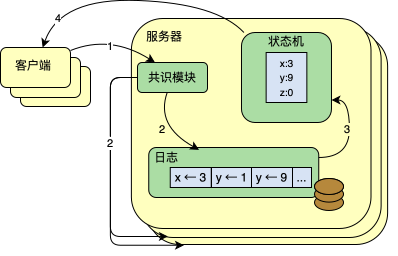

> **图 1**：复制状态机架构。共识算法管理着一个被复制的日志，其中包含来自客户端的对状态机的操作命令。状态机们按照同等顺序处理日志中命令，因此产出相同的输出结果。

保持复制日志一致是共识算法的职责。服务器上的共识模块从客户端接收命令，并将其加入自己的日志。它与其他服务器上的共识模块通信，以确保每个日志最终以相同的顺序包含相同的请求，即使某些服务器失效。一旦命令被正确复制，每台服务器的状态机就按日志顺序处理它们，并将输出返回给客户端。结果，这些服务器看起来像构成了一台单一的、高度可靠的状态机。

实际系统的共识算法通常具有以下性质：

- 在所有非拜占庭条件下（包括网络延迟、分区、以及数据包丢失、重复、乱序）保证安全（绝不返回错误结果）。
- 只要任意多数派的服务器处于运行状态且能彼此及与客户端通信，算法就完全可用。因此，一个典型的五台服务器集群可以容忍任意两台服务器失效。假设服务器以停止（stop）方式失效；它们之后可以从稳定存储中的状态恢复并重新加入集群。
- 它们不依赖时间来保证日志的一致性：错误的时钟和极端的消息延迟最多只能导致可用性问题。
- 在通常情况下，只要集群多数派响应了一轮远程过程调用，一条命令即可完成；少数慢服务器不需要影响整体系统性能。

## 3 Paxos 的问题在哪里

在过去十年中，Leslie Lamport 的 Paxos 协议 [15] 几乎成了共识的同义词：它是课程中最常讲授的协议，大多数共识实现都以其为起点。Paxos 首先定义了一种能够就单个决策（例如单个复制日志条目）达成一致的协议。我们把这个子集称为单决议 Paxos（single-decree Paxos）。然后 Paxos 将该协议的多个实例组合起来，以支持一系列决策（例如一个日志，即 multi-Paxos）。Paxos 同时保证了安全性和活性，并且支持集群成员关系的变更。它的正确性已被证明，并且在通常情况下是高效的。

不幸的是，Paxos 有两个显著的缺陷。第一个缺陷是 Paxos 极难理解。完整的解释 [15] 出了名地晦涩；很少有人能够理解它，而且只有付出巨大努力才行。因此，已有若干尝试以更简单的术语解释 Paxos [16,20,21]。这些解释聚焦于单决议子集，但依然具有挑战性。在 2012 年 NSDI 的一次非正式调查中，我们发现很少有人对 Paxos 感到得心应手，即使在资深研究者中也是如此。我们自己也被 Paxos 折磨：在读完几篇简化解释并设计了我们自己的替代协议之前，我们一直无法理解完整的协议，这一过程花了将近一年。

我们假设，Paxos 的晦涩源于它选择单决议子集作为基础。单决议 Paxos 密集而微妙：它被分为两个阶段，这两个阶段都没有简单直观的解释，也无法被独立理解。因此，很难对单决议协议为什么能工作建立直觉。multi-Paxos 的组合规则又增加了显著的额外复杂性和微妙之处。我们认为，就多个决策（即一个日志，而非单个条目）达成共识这一整体问题，可以以其他更直接、更明显的方式分解。

Paxos 的第二个问题是，它未能为构建实际实现提供良好的基础。原因之一在于，对于 multi-Paxos 不存在被广泛认同的算法。Lamport 的描述大多关于单决议 Paxos；他为 multi-Paxos 勾画了可能的方法，但许多细节缺失。已有若干尝试来充实和优化 Paxos，例如 [26]、[39] 和 [13]，但它们彼此差异很大，且与 Lamport 的勾画也不同。因此，系统构建者只能从零开始设计自己的多决议协议。

此外，Paxos 的架构不适合构建实际系统；这是单决议分解的又一个后果。例如，独立地选择一组日志条目、再把它们融合成一个顺序日志，几乎没有什么好处；这只会增加复杂性。围绕日志来设计系统更简单、更高效，在这种设计中新条目以受限的顺序被顺序追加。另一个问题是，Paxos 其核心使用了对称的 peer-to-peer 方法（尽管它最终建议了一种弱形式的领导作为性能优化）。在一个只会做出一个决策的简化世界里这说得通，但几乎没有实际系统采用这种方法。如果必须做出一系列决策，先选举一个领导者、再由领导者协调这些决策，会更简单、更快速。

结果，实际系统与 Paxos 很少相似之处。每种实现都从 Paxos 开始，发现实现它的困难，然后发展出一个明显不同的架构。这既耗时又容易出错，而对 Paxos 的理解困难更恶化了这个问题。Paxos 的表述可能适合用来证明其正确性的定理，但真正的实现与 Paxos 差异如此之大，以至于那些证明几乎没有价值。Chubby 实现者的以下评论很典型：

> “在 Paxos 算法的描述与现实系统的需求之间存在显著差距……最终系统将基于一个未经证实的协议 [4]。”

由于这些问题，我们得出结论：Paxos 无论对于系统构建还是对于教育，都没有提供良好的基础。鉴于共识在大规模软件系统中的重要性，我们决定看看能否设计出一种比 Paxos 性质更好的替代共识算法。Raft 就是那个实验的结果。

## 4 为可理解性而设计

在设计 Raft 时我们有若干目标：它必须为系统构建提供完整而实用的基础，从而显著减少开发者所需的设计工作量；它必须在所有条件下安全，并在典型运行条件下可用；并且它对常见操作必须高效。但我们最重要的目标——也是最困难的挑战——是可理解性。它必须能让广大受众轻松理解该算法。此外，必须能够对该算法建立直觉，以便系统构建者能够进行现实实现中不可避免的扩展。

在 Raft 的设计中有许多时刻，我们不得不在多种方案之间做出选择。在这些情况下，我们基于可理解性来评估各种方案：解释每种方案有多难（例如，它的状态空间有多复杂，是否有微妙的含义？），以及读者要完全理解该方案及其含义有多容易？

我们认识到这种分析有很高的主观性；尽管如此，我们还是使用了两种普遍适用的技术。第一种技术是众所周知的问题分解法：只要可能，我们就把问题分成可以相对独立地求解、解释和消化的独立部分。例如，在 Raft 中我们将领导者选举、日志复制、安全性和成员变更分离开来。我们的第二种方法是通过减少需要考虑的状态数量来简化状态空间，使系统更加一致，并在可能的地方消除非确定性。具体来说，日志不允许有空洞，并且 Raft 限制了日志彼此之间变得不一致的方式。尽管在大多数情况下我们试图消除非确定性，但在某些情况下非确定性实际上提高了可理解性。特别是，随机化方法引入了非确定性，但它们倾向于通过以相似方式处理所有可能的选择（“任选一个，无关紧要”）来缩减状态空间。我们使用随机化来简化 Raft 的领导者选举算法。

## 5 Raft 共识算法

Raft 是一种用于管理第 2 节所述形式之复制日志的算法。图 2 以浓缩形式总结了该算法以供参考，图 3 列出了算法的关键性质；这些图中的要素将在本节余下部分逐一讨论。

Raft 通过首先选举出一个特殊的领导者，然后将管理复制日志的全部职责交给该领导者，来实现共识。领导者从客户端接受日志条目，在其他服务器上复制它们，并告诉服务器何时可以安全地将日志条目应用到它们的状态机。由一位领导者来管理复制日志简化了工作。例如，领导者可以决定把新条目放在日志的什么位置，而无需咨询其他服务器，并且数据以简单的方式从领导者流向其他服务器。领导者可能失效，或与其他服务器断开连接，此时会选举出一位新领导者。

基于领导者这一思路，Raft 将共识问题分解为三个相对独立的子问题，在接下来的小节中讨论：

- **领导者选举**：当现有领导者失效时，必须选出一位新领导者（第 5.2 节）。
- **日志复制**：领导者必须接受来自客户端的日志条目，并将它们在集群中复制，迫使其他日志与自己的日志一致（第 5.3 节）。
- **安全性**：Raft 的关键安全性性质是图 3 中的状态机安全性性质：如果任何服务器已将某个特定的日志条目应用到它的状态机，那么没有其他服务器可以就同一个日志索引应用不同的命令。第 5.4 节描述 Raft 如何确保这一性质；其解决方案涉及对第 5.2 节所述选举机制的额外限制。

在给出共识算法之后，本节讨论可用性问题以及时间在系统中的作用。

> **图 2**：Raft 共识算法的浓缩概要（不包括成员变更和日志压缩）左上角方框中的服务器行为是一组独立且反复触发的规则。小节编号，如 §5.2 指明了讨论此特性的章节。形式化规范 [31] 更精确地描述了该算法。

| 性质                               | 说明                                                      |
|----------------------------------|---------------------------------------------------------|
| **选举安全性**（Election Safety）       | 在给定任期内最多只能选出一个领导者。§5.2                                  |
| **领导者只追加**（Leader Append-Only）   | 领导者绝不覆盖或删除自己日志中的条目；它只追加新条目。§5.3                         |
| **日志匹配**（Log Matching）           | 若两个日志包含相同索引和任期的条目，则这两个日志在所有该索引之前的条目上都完全相同。§5.3          |
| **领导者完整性**（Leader Completeness）  | 若一个日志条目在某个任期被提交，那么该条目将出现在所有编号更高之任期的领导者的日志中。§5.4         |
| **状态机安全性**（State Machine Safety） | 若某服务器已将某个索引的日志条目应用到其状态机，则没有其他服务器会对同一个索引应用不同的日志条目。§5.4.3 |

> **图 3**：Raft 保证这些性质在任何时刻都成立。小节编号指明了此性质相关内容所在章节。

### 5.1 Raft 基础

Raft 集群包含若干台服务器；五台是典型数量，允许系统容忍两次失效。任意时刻每台服务器处于三种状态之一：领导者、追随者或候选者。在正常操作中恰好有一位领导者，其余所有服务器都是追随者。追随者是被动的：它们自己不发起请求，只是简单地响应来自领导者和候选者的请求。领导者处理所有客户端请求（如果客户端联系了一位追随者，追随者会把它重定向到领导者）。第三种状态，候选者，用于如第 5.2 节所述选举新领导者。图 4 展示了这些状态及其转换；转换将在下文中讨论。

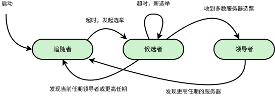

> **图 4**：服务器状态。追随者仅回复其他服务器发来的请求。如果一个追随者没有收到任何通信消息，它将转变为候选者并启动一次选举。一个候选者，在接收到完整集群多数派的投票后会成为新的领导者。领导者通常会持续履行职责直到发生故障。

Raft 将时间划分为任意长度的任期（term），如图 5 所示。任期用连续整数编号。每个任期以一次选举开始，在选举中一个或多个候选者尝试成为领导者（如第 5.2 节所述）。如果某候选者赢得选举，那么它在任期剩余时间内担任领导者。在某些情况下，选举会导致选票分裂（split vote）。在这种情况下，该任期将在没有领导者的情况下结束；一个新的任期（伴随一次新选举）将很快开始。Raft 确保在给定任期内最多只有一位领导者。

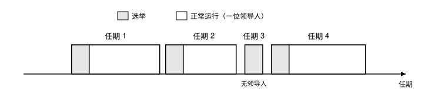

> **图 5**：时间根据任期划分，每个任期由一次选举开启。当一次选举成功后，一位领导者管理集群直到任期结束。有些选举会失败，此情况下该任期以无领导者状态结束。不同的服务器会在不同时刻观测到任期的转变。

不同的服务器可能在不同时间观察到任期之间的转换，并且在某些情况下，某台服务器可能观察不到一次选举、甚至整个任期。任期在 Raft 中充当逻辑时钟 [14]，它们允许服务器检测过期信息，例如陈旧的领导者。每台服务器存储一个当前任期号，它随时间单调递增。每当服务器通信时就交换当前任期；如果一台服务器的当前任期小于另一台的，则它把自己的当前任期更新为较大的值。如果候选者或领导者发现自己任期过时，它会立即回退到追随者状态。如果服务器收到带有陈旧任期号的请求，它会拒绝该请求。

Raft 服务器使用远程过程调用（RPC）通信，基本共识算法只需要两种 RPC。RequestVote RPC 由候选者在选举期间发起（第 5.2 节），AppendEntries RPC 由领导者发起以复制日志条目并作为一种心跳（第 5.3 节）。第 7 节增加了第三种 RPC，用于在服务器间传输快照。服务器若未及时收到响应就会重试 RPC，并且为了最佳性能它们并行发出 RPC。

### 5.2 领导者选举

Raft 使用心跳机制来触发领导者选举。服务器启动时，它们以追随者身份开始。只要服务器从领导者和候选者收到有效的 RPC，它就保持在追随者状态。领导者定期向所有追随者发送心跳（不携带日志条目的 AppendEntries RPC）以维持其权威。如果追随者在一段称为选举超时（election timeout）的时间内没有收到任何通信，它就假定没有可行的领导者，并开始一次选举以选出新领导者。要开始一次选举，追随者递增其当前任期并转换到候选者状态。然后它为自己投票，并并行地向集群中其他每台服务器发出 RequestVote RPC。候选者保持这种状态，直到以下三件事之一发生：(a) 它赢得选举，(b) 另一台服务器确立自己为领导者，或 (c) 一段时间过去而没有赢家。这些结果将在下面各段分别讨论。

如果候选者在同一任期内收到来自集群全体多数派的选票，它就赢得选举。每台服务器在给定的任期内最多投一票，按先到先得的原则（注意：第 5.4 节对投票增加了额外限制）。多数派规则确保对于给定的任期最多只有一个候选者能赢得选举（图 3 中的选举安全性性质）。一旦候选者赢得选举，它就成为领导者。然后它向所有其他服务器发送心跳消息以确立其权威并防止新的选举。

在等待选票时，候选者可能收到来自另一台自称是领导者的服务器的 AppendEntries RPC。如果领导者的任期（包含在 RPC 中）至少与候选者的当前任期一样大，那么候选者承认该领导者为合法，并返回追随者状态。如果 RPC 中的任期小于候选者的当前任期，那么候选者拒绝该 RPC 并继续处于候选者状态。

第三种可能的结果是候选者既未赢也未输掉选举：如果许多追随者同时成为候选者，选票可能分裂，以至于没有候选者获得多数派。当这种情况发生时，每个候选者将超时，并通过递增其任期并发起另一轮 RequestVote RPC 来开始一次新选举。然而，如果没有额外措施，选票分裂可能无限重复。

Raft 使用随机化的选举超时来确保选票分裂罕见，并且能迅速解决。为了防止一开始就出现选票分裂，选举超时从一个固定区间（例如 150–300ms）中随机选择。这把服务器分散开，因此在大多数情况下只有一台服务器会超时；它赢得选举并在任何其他服务器超时之前发送心跳。同样的机制用于处理选票分裂。每个候选者在新选举开始时重启其随机化选举超时，并等待该超时过去后才开始下一次选举；这降低了新选举中再次出现选票分裂的可能性。第 9.3 节表明这种方法能快速选出领导者。

选举是一个例子，展示了我们如何以可理解性为指导，在不同的设计候选项中做出选择。最初我们计划使用一种排名系统：每个候选者被分配一个唯一的排名，用于在相互竞争的候选者之间做选择。如果候选者发现另一个排名更高的候选者，它会返回追随者状态，以便排名更高的候选者更容易赢得下一次选举。我们发现这种方法围绕可用性产生了微妙的问题（如果排名较高的服务器失效，排名较低的服务器可能需要超时并再次成为候选者，但如果它太快这样做，就会重置选出一个领导者的进度）。我们在算法上做了几次调整，但每次调整后都会出现新的边界情况。最终我们得出结论：随机化重试方法更明显、更易懂。

### 5.3 日志复制

一旦选出领导者，它就开始处理客户端请求。每个客户端请求包含一个要由复制状态机执行的命令。领导者将该命令作为新条目追加到自己的日志中，然后并行地向其他每台服务器发出 AppendEntries RPC 以复制该条目。当该条目被安全复制（如下所述）后，领导者将该条目应用到自己的状态机，并将执行结果返回给客户端。如果追随者崩溃或运行缓慢，或者网络数据包丢失，领导者会无限重试 AppendEntries RPC（即使在已经响应了客户端之后），直到所有追随者最终都存储了所有日志条目。

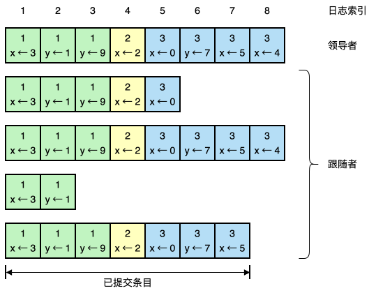

> **图 6**：日志由顺序编号的条目组成。每个条目包含创建它的任期（方框中的数字）和一条状态机命令。当一个条目可以被安全地应用到状态机时，就认为它已被提交（committed）。

日志的组织如图 6 所示。每个日志条目存储一条状态机命令以及该条目被领导者接收时的任期号。日志条目中的任期号用于检测日志之间的不一致，并确保图 3 中的某些性质。每个日志条目还有一个整数索引，标识它在日志中的位置。

领导者决定何时可以安全地将一个日志条目应用到状态机；这样的条目称为已提交（committed）。Raft 保证已提交的条目是持久的，并且最终会被所有可用的状态机执行。一旦创建该条目的领导者已将它在多数派服务器上完成复制，该日志条目就被提交（例如图 6 中的条目 7）。这也提交了领导者日志中所有先前的条目，包括由先前领导者创建的条目。第 5.4 节讨论领导者变更后应用此规则的一些微妙之处，并表明这一定义的安全性。领导者追踪它已知已提交的最高索引，并在未来的 AppendEntries RPC（包括心跳）中包含该索引，以便其他服务器最终得知。一旦追随者得知某个日志条目已提交，它就（按日志顺序）将该条目应用到自己的本地状态机。

我们设计 Raft 的日志机制，以保持不同服务器上日志的高度一致性。这不仅简化了系统的行为并使其更可预测，而且是确保安全性的重要组成部分。Raft 维持以下性质，它们共同构成图 3 中的**日志匹配性质**：

- 若不同日志中的两个条目具有相同的索引和任期，则它们存储相同的命令。
- 若不同日志中的两个条目具有相同的索引和任期，则这两个日志在所有先前的条目上都相同。

第一个性质源于这样一个事实：领导者在给定任期内最多为一个给定的日志索引创建一个条目，且日志条目永远不会改变它们在日志中的位置。第二个性质由 AppendEntries 执行的一个简单一致性检查来保证。发送 AppendEntries RPC 时，领导者包含其日志中紧邻新条目之前的那个条目的索引和任期。如果追随者在其日志中没有找到具有相同索引和任期的条目，它就拒绝新条目。一致性检查充当归纳步骤：日志初始的空状态满足日志匹配性质，并且一致性检查在日志被扩展时始终保持日志匹配性质。因此，每当 AppendEntries 成功返回时，领导者就知道追随者的日志与自己的日志在新条目之前完全相同。

在正常操作中，领导者和追随者的日志保持一致，因此 AppendEntries 一致性检查永远不会失败。然而，领导者崩溃可能使日志变得不一致（旧领导者可能没有完整地复制其日志中的所有条目）。这些不一致会在一连串的领导者和追随者崩溃中累积。图 7 说明了追随者日志可能不同于新领导者日志的各种方式。追随者可能缺失领导者上存在的条目，可能有领导者上不存在的多余条目，或者两者兼有。日志中缺失和多余的条目可能跨越多个任期。

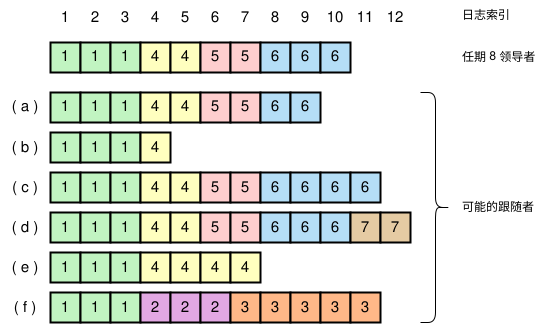

> **图 7**：当顶部的领导者上台时，追随者日志中可能出现 (a–f) 任意一种情形。每个方框代表一个日志条目；方框中的数字是其任期。追随者可能缺失条目（a–b）、可能有额外的未提交条目（c–d），或两者兼有（e–f）。比如说，情形（f）可能出现，如果此服务器在任期 2 是领导者，添加了一些条目到其日志中，随即崩溃，未能提交任何条目；它很快重启并且成为了任期 3 的领导者，并添加了更多条目到其日志中；在提交任何任期 2 或任期 3 的日志前，它再度崩溃，并在后续的多个任期内依然保持宕机。

在 Raft 中，领导者通过强制追随者的日志复制自己的日志来处理不一致。这意味着追随者日志中冲突的条目将被领导者日志中的条目覆盖。第 5.4 节将表明，再加上一条额外的限制，这样做是安全的。

为了使追随者的日志与自己一致，领导者必须找到两个日志一致的最后一个日志条目，删除追随者日志中该点之后的任何条目，并发送领导者日志中该点之后的所有条目给追随者。所有这些动作都是响应 AppendEntries RPC 所执行的一致性检查而发生的。领导者为每个追随者维护一个 `nextIndex`，即领导者将发送给该追随者的下一个日志条目的索引。当领导者刚上台时，它将所有 `nextIndex` 初始化为其日志中最后一个条目之后的索引（图 7 中为 11）。如果追随者的日志与领导者的不一致，下一次 AppendEntries RPC 中的一致性检查将失败。被拒绝后，领导者递减 `nextIndex` 并重试 AppendEntries RPC。最终 `nextIndex` 会到达领导者与追随者日志匹配的点。此时 AppendEntries 将成功，它会删除追随者日志中任何冲突的条目，并追加领导者日志中的条目（如果有的话）。一旦 AppendEntries 成功，追随者的日志就与领导者的一致，并且在该任期剩余时间内将一直保持一致。

> 如果愿意，协议可以被优化以减少被拒绝的 AppendEntries RPC 数量。例如，当拒绝一个 AppendEntries 请求时，追随者可以包含冲突条目的任期，以及它为该任期存储的第一个索引。有了这些信息，领导者可以递减 `nextIndex` 以跳过该任期内所有冲突的条目；对于包含冲突条目的每个任期只需要一个 AppendEntries RPC，而不是每个条目一个。在实践中，我们怀疑这种优化是否必要，因为故障很少发生，而且不太可能有许多不一致的条目。

有了这种机制，领导者在上台时不需要采取任何特殊动作来恢复日志一致性。它只是开始正常操作，日志会自动响应 AppendEntries 一致性检查的失败而收敛。领导者绝不覆盖或删除自己日志中的条目（图 3 中的**领导者只追加**性质）。

这种日志复制机制展现出了第 2 节描述的理想的共识性质：只要多数派服务器在线，Raft 就能接受、复制和应用新的日志条目；在通常情况下，一个新条目只需一轮 RPC 即可复制到集群多数派；并且单个慢追随者不会影响性能。

### 5.4 安全性

前几节描述了 Raft 如何选举领导者和复制日志条目。然而，目前描述的机制还不足以确保每台状态机以相同顺序执行完全相同的命令。例如，一个追随者可能在领导者提交若干日志条目时不可用，然后它可能被选为领导者并用新条目覆盖这些条目；结果，不同的状态机可能执行不同的命令序列。

本节通过增加对哪些服务器可以被选为领导者的限制，来完成 Raft 算法。该限制确保任何给定任期的领导者包含先前任期中所有已提交的条目（图 3 中的**领导者完整性**性质）。在给定选举限制之后，我们使提交的规则更加精确。最后，我们给出领导者完整性性质的证明草图，并展示它如何导出复制状态机的正确行为。

#### 5.4.1 选举限制

在任何基于领导者的共识算法中，领导者最终必须存储所有已提交的日志条目。在一些共识算法中，例如 Viewstamped Replication [22]，即使领导者最初并不包含所有已提交的条目，也可以当选。这些算法包含额外的机制，以在选举过程中或选举后不久识别缺失的条目并将它们传送给新领导者。不幸的是，这导致了相当多的额外机制和复杂性。Raft 使用一种更简单的方法，它保证从选举时刻起，每个新领导者身上就已经包含了先前任期中所有已提交的条目，而无需将这些条目传送给领导者。这意味着日志条目只朝一个方向流动，从领导者到追随者，并且领导者绝不覆盖其日志中已有的条目。

Raft 使用投票过程来阻止候选者赢得选举，除非它的日志包含所有已提交的条目。候选者必须联系集群的多数派才能当选，这意味着每个已提交的条目必然至少存在于那些服务器中的一台上。如果候选者的日志至少和该多数派中任何一台的日志一样新（其中“一样新”在下面精确定义），那么它将持有所有已提交的条目。RequestVote RPC 实现了这一限制：RPC 包含候选者日志的信息，如果投票者自己的日志比候选者的日志更新，它就拒绝投票。

Raft 通过比较日志中最后条目的索引和任期，来确定两个日志中哪一个更新。如果日志的最后条目具有不同的任期，则任期较后的日志更新。如果日志以相同的任期结束，则较长的日志更新。

#### 5.4.2 提交先前任期的日志条目

如第 5.3 节所述，一旦领导者当前任期的某个条目被存储在多数派服务器上，领导者就知道该条目已提交。如果领导者在提交某个条目之前崩溃，未来的领导者将尝试完成该条目的复制。然而，一旦某个先前任期的条目被存储在多数派服务器上，领导者不能立即断定它已被提交。图 8 说明了这样一种情形：一个旧的日志条目被存储在多数派服务器上，却仍可能被未来的领导者覆盖。

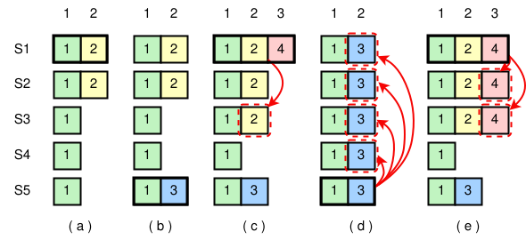

> **图 8**：一个时间序列，展示领导者为什么不能仅凭旧任期的日志条目来确定提交。在 (a) 中 S1 是领导者，并部分复制了索引 2 处的日志条目。在 (b) 中 S1 崩溃；S5 凭 S3、S4 和自身的选票当选任期 3 的领导者，并在日志索引 2 处接受了一个不同的条目。在 (c) 中 S5 崩溃；S1 重启，当选领导者，并继续复制。此时，任期 2 的日志条目已在多数派服务器上复制，但并未提交。如果 S1 如 (d) 中那样崩溃，S5 可能当选领导者（凭 S2、S3、S4 的选票）并用它自己任期 3 的条目覆盖该条目。然而，如果 S1 在崩溃前如 (e) 中那样在多数派服务器上复制了它当前任期的某个条目，那么该条目就被提交了（S5 无法赢得选举）。此时日志中所有先前的条目也都已被提交。

为了消除图 8 中的问题，Raft 从不通过统计副本数来提交先前任期的日志条目。只有领导者当前任期的日志条目才通过统计副本数来提交；一旦以这种方式提交了当前任期的某个条目，那么由于日志匹配性质，所有先前的条目都被间接地提交了。在某些情形下，领导者可以安全地断定一个较旧的日志条目已被提交（例如，如果该条目存储在每一台服务器上），但 Raft 为了简单起见采取了更保守的方法。

Raft 在提交规则上招来这一额外复杂性，是因为当领导者复制先前任期的条目时，日志条目保留了它们原始的任期号。在其他共识算法中，如果新领导者重新复制来自先前“任期”的条目，它必须用它的新“任期号”来这样做。Raft 的方法使得推理日志条目更容易，因为它们随时间跨日志保持相同的任期号。此外，Raft 中的新领导者发送的来自先前任期的日志条目少于其他算法（其他算法必须发送冗余的日志条目，在它们能被提交之前重新编号）。

#### 5.4.3 安全性论证

给定完整的 Raft 算法，我们现在可以更精确地论证**领导者完整性**性质成立（该论证基于安全性证明；见第 9.2 节）。我们假设领导者完整性性质不成立，然后证明一个矛盾。假设任期 T 的领导者（leaderT）提交了它本任期的一个日志条目，但该条目未被某个未来任期的领导者存储。考虑最小的任期 U > T，其领导者（leaderU）不存储该条目。

1. 该已提交条目在 leaderU 选举时必然不在它的日志中（领导者绝不删除或覆盖条目）。
2. leaderT 在集群多数派上复制了该条目，而 leaderU 从集群多数派处获得了选票。因此，至少有一台服务器（“投票者”）既从 leaderT 接受了该条目，又投票给了 leaderU。
3. 投票者必然在投票给 leaderU 之前从 leaderT 接受了该已提交条目；否则它会拒绝来自 leaderT 的 AppendEntries 请求（它的当前任期会高于 T）。
4. 投票者在投票给 leaderU 时仍然存储着该条目，因为介于其间的每个领导者都包含该条目（由假设），领导者从不移除条目，而追随者只在条目与领导者冲突时才移除条目。
5. 投票者将其选票授予了 leaderU，所以 leaderU 的日志必然和投票者的一样新。这导致两种矛盾之一。
6. 首先，如果投票者和 leaderU 具有相同的最后日志任期，那么 leaderU 的日志必然至少和投票者的一样长，因此它的日志包含了投票者日志中的每个条目。这是矛盾的，因为投票者包含该已提交条目，而假设 leaderU 不包含。
7. 否则，leaderU 的最后日志任期必然大于投票者的。而且它大于 T，因为投票者的最后日志任期至少为 T（它包含来自任期 T 的已提交条目）。创建 leaderU 最后日志条目的较早领导者必然在其日志中包含该已提交条目（由假设）。那么，由日志匹配性质，leaderU 的日志也必然包含该已提交条目，这同样是矛盾。
8. 这完成了矛盾。因此，所有大于 T 的任期的领导者必须包含任期 T 中在任期 T 提交的所有条目。
9. 日志匹配性质保证未来的领导者也将包含被间接提交的条目，例如图 8(d) 中的索引 2。

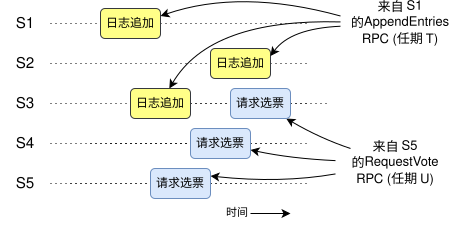

> **图 9**：如果 S1（任期 T 的领导者）提交了它本任期的一个新日志条目，而 S5 被选为更后期 U 的领导者，那么必然至少有一台服务器（S3）既接受了该日志条目，又投票给了 S5。

给定领导者完整性性质，我们可以证明图 3 中的**状态机安全性**性质，它指出：如果某服务器已将某个索引的日志条目应用到其状态机，则没有其他服务器会就同一个索引应用不同的日志条目。在服务器将某个日志条目应用到其状态机时，它的日志到该条目为止必然与领导者的日志相同，并且该条目必然已提交。现在考虑任何服务器应用某个给定日志索引的最低任期；日志完整性性质保证所有更高任期的领导者将存储同一个日志条目，因此在更后期应用该索引的服务器将应用相同的值。于是，状态机安全性性质成立。

最后，Raft 要求服务器按日志索引顺序应用条目。结合状态机安全性性质，这意味着所有服务器将以相同的顺序，将完全相同的日志条目集合应用到它们的状态机。

### 5.5 追随者与候选者的崩溃

到目前为止我们一直关注领导者失效。追随者和候选者的崩溃比领导者崩溃容易处理得多，并且它们以相同方式处理。如果追随者或候选者崩溃，那么未来发给它的 RequestVote 和 AppendEntries RPC 将会失败。Raft 通过无限重试来处理这些失败；如果崩溃的服务器重启，那么 RPC 就会成功完成。如果一台服务器在完成 RPC 之后、响应之前崩溃，那么它重启后会再次收到同一个 RPC。Raft 的 RPC 是幂等的，所以这不会造成危害。例如，如果追随者收到一个 AppendEntries 请求，其中包含其日志中已经存在的日志条目，它会忽略新请求中的那些条目。

### 5.6 时间与可用性

我们对 Raft 的要求之一是安全性不能依赖时间：系统绝不能仅仅因为某些事件发生得比预期更快或更慢就产生不正确的结果。然而，可用性（系统及时响应客户端的能力）不可避免地要依赖时间。例如，如果消息交换所花时间超过了服务器崩溃之间的典型时间，候选者将无法存活足够长以赢得选举；没有稳定的领导者，Raft 就无法取得进展。

领导者选举是 Raft 中对时间最关键的方面。只要系统满足以下时间要求，Raft 就能选举并维持一个稳定的领导者：

> `broadcastTime ≪ electionTimeout ≪ MTBF`

在这个不等式中，`broadcastTime` 是服务器并行向集群中每台服务器发送 RPC 并收到它们响应所需的平均时间；`electionTimeout` 是第 5.2 节描述的选举超时；`MTBF` 是单台服务器的平均故障间隔时间。广播时间应比选举超时要小一个数量级，这样领导者才能可靠地发送维持追随者不发起选举所需的心跳消息；鉴于选举超时使用的随机化方法，这个不等式也使得选票分裂不太可能。选举超时应该比 MTBF 小几个数量级，这样系统才能稳步前进。当领导者崩溃时，系统将不可用大约选举超时那么久；我们希望这仅占整体时间的一小部分。

广播时间和 MTBF 是底层系统的属性，而选举超时是我们需要选择的。Raft 的 RPC 通常要求接收方将信息持久化到稳定存储，因此广播时间可能在 0.5ms 到 20ms 之间，取决于存储技术。因此，选举超时很可能在 10ms 到 500ms 之间。典型的服务器 MTBF 为几个月或更久，这轻易满足时间要求。

## 6 集群成员变更

到目前为止我们假设集群配置（参与共识算法的服务器集合）是固定的。在实践中，偶尔有必要变更配置，例如在服务器失效时替换它们，或改变复制程度。虽然这可以通过让整个集群离线、更新配置文件、然后重启集群来完成，但这会在切换期间使集群不可用。此外，如果有任何手动步骤，就有操作失误的风险。为了避免这些问题，我们决定自动化配置变更，并将其纳入 Raft 共识算法。

为了使配置变更机制安全，在过渡期间必须不存在任何可能选出两个同一任期领导者的时刻。不幸的是，任何让服务器直接从旧配置切换到新配置的方法都是不安全的。不可能一次性原子地切换所有服务器，所以集群在过渡期间可能分裂成两个独立的多数派（见图 10）。

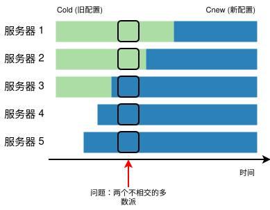

> **图 10**：直接从一种配置切换到另一种配置是不安全的，因为不同的服务器会在不同时刻切换。在这个例子中，集群从三台服务器增长到五台。不幸的是，在某个时刻可能为同一任期选出两个不同的领导者，一个拥有旧配置（Cold）的多数派，另一个拥有新配置（Cnew）的多数派。

为了确保安全，配置变更必须使用两阶段方法。实现这两个阶段有各种方式。例如，某些系统（如 [22]）使用第一阶段禁用旧配置使其无法处理客户端请求；然后第二阶段启用新配置。在 Raft 中，集群首先切换到一个我们称为联合共识（joint consensus）的过渡配置；一旦联合共识被提交，系统再过渡到新配置。联合共识同时结合了旧配置和新配置：

- 日志条目被复制到两个配置中的所有服务器。
- 旧配置或新配置中的任何服务器都可以成为领导者。
- 达成共识（包括选举和条目提交）需要分别获得旧配置和新配置的各自多数派。

联合共识允许各个服务器在不同时间之间过渡，而不损害安全性。此外，联合共识允许集群在整个配置变更期间继续为客户端请求服务。

集群配置使用复制日志中的特殊条目来存储和通信；图 11 说明了配置变更过程。当领导者收到将配置从 Cold 变更到 Cnew 的请求时，它将联合共识的配置（图中为 Cold,new）作为一个日志条目存储，并使用前面描述的机制复制该条目。一旦某台给定的服务器将该新配置条目加入自己的日志，它就将该配置用于所有未来的决策（服务器总是使用其日志中的最新配置，无论该条目是否已提交）。这意味着领导者将使用 Cold,new 的规则来确定 Cold,new 的日志条目何时被提交。如果领导者崩溃，可能会根据胜出的候选者是否收到了 Cold,new，在 Cold 或 Cold,new 下选出新领导者。无论如何，在此期间 Cnew 不能单方面做决定。

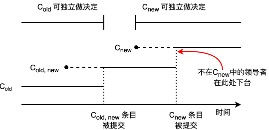

> **图 11**：一次配置变更的时间线。虚线表示已创建但未提交的配置条目，实线表示最新已提交的配置条目。领导者首先在它的日志中创建 Cold,new 配置条目，并将其提交到 Cold,new（Cold 的一个多数派和 Cnew 的一个多数派）。然后它创建 Cnew 条目，并将其提交到 Cnew 的一个多数派。任何时刻 Cold 和 Cnew 都无法各自独立做决定。

一旦 Cold,new 被提交，Cold 和 Cnew 都不能在没有对方批准的情况下做决定，并且领导者完整性性质确保只有带有 Cold,new 日志条目的服务器才能被选为领导者。现在领导者可以安全地创建一个描述 Cnew 的日志条目并将其复制到集群。同样，该配置将在每台服务器看到它时立即生效。当新配置已在 Cnew 规则下提交，旧配置就无关紧要了，不在新配置中的服务器可以被关闭。如图 11 所示，没有任何时刻 Cold 和 Cnew 能单方面做决定；这保证了安全性。

还有三个关于重新配置的问题需要处理。第一，新服务器可能最初没有存储任何日志条目。如果在这种状态下将它们加入集群，它们可能需要相当长时间才能追上，在此期间可能无法提交新的日志条目。为了避免可用性缺口，Raft 在配置变更之前引入了一个额外的阶段，在此阶段新服务器作为无投票权的成员加入集群（领导者向它们复制日志条目，但它们不计入多数派）。一旦新服务器赶上了集群的其余部分，就可以如上所述进行重新配置。

第二，集群领导者可能不在新配置中。在这种情况下，一旦领导者提交了 Cnew 日志条目，它就退位（返回追随者状态）。这意味着会有一段时期（在提交 Cnew 期间）领导者管理着一个不包含它自己的集群；它复制日志条目，但在多数派中不把自己计算在内。领导者转换发生在 Cnew 被提交时，因为这是新配置可以独立运行的第一时刻（从 Cnew 中总能选出一个领导者）。在此点之前，可能只有来自 Cold 的服务器才能被选为领导者。

第三，被移除的服务器（不在 Cnew 中的）会干扰集群。这些服务器不会收到心跳，所以会超时并开始新的选举。然后它们会以新的任期号发送 RequestVote RPC，这会导致当前领导者回退到追随者状态。最终会选出新领导者，但被移除的服务器会再次超时，过程会重复，导致可用性下降。

为了防止这个问题，当服务器认为当前存在领导者时，它会忽略 RequestVote RPC。具体来说，如果服务器在听到当前领导者的消息后的最小选举超时时间内收到 RequestVote RPC，它不会更新自己的任期，也不会授予选票。这不会影响正常选举，因为在正常选举中每台服务器在开始选举前至少等待一个最小选举超时。然而，它有助于避免来自被移除服务器的干扰：如果领导者能够向其集群发送心跳，那么它就不会被更大的任期号废黜。

## 7 日志压缩

Raft 的日志在正常操作中会随着纳入更多客户端请求而增长，但在实际系统中，它不能无界增长。随着日志变长，它占用更多空间，重放也需要更长时间。如果没有某种机制丢弃日志中累积的过时信息，这最终会导致可用性问题。

快照（snapshotting）是最简单的压缩方法。在快照中，整个当前系统状态被写入稳定存储上的快照，然后丢弃日志中直到该点的整个部分。图 12 展示了 Raft 中快照的基本思想。每台服务器独立地拍摄快照，只覆盖其日志中已提交的条目。大部分工作由状态机将其当前状态写入快照组成。Raft 还在快照中包含少量元数据：`last included index` 是快照所替换的日志中最后一个条目的索引（状态机已应用的最后一个条目），`last included term` 是该条目的任期。保留它们是为了支持快照之后第一个日志条目的 AppendEntries 一致性检查，因为该条目需要一个先前的日志索引和任期。为了支持集群成员变更（第 6 节），快照还包含在 `last included index` 处的日志中的最新配置。一旦服务器完成写入快照，它就可以删除直到 `last included index` 的所有日志条目，以及任何先前的快照。

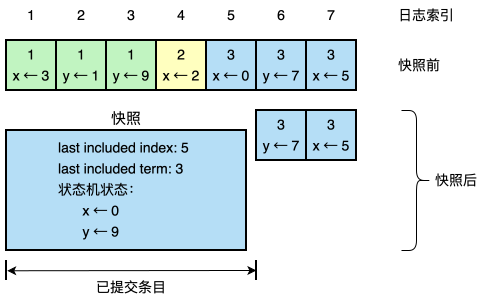

> **图 12**：一台服务器用一个新的快照替换其日志中已提交的条目（索引 1 到 5），该快照只存储当前状态（本例中为变量 x 和 y）。快照的 last included index 和 last included term 用来在日志中将快照定位于条目 6 之前。

尽管服务器通常独立地拍摄快照，领导者有时必须向落后的追随者发送快照。当领导者已经丢弃了它需要发送给某个追随者的下一个日志条目时，就会发生这种情况。幸运的是，在正常操作中这种情况不太可能：一个跟上了领导者的追随者，领导者本来就已经有这个条目。然而，一个异常慢的追随者或加入集群的新服务器（第 6 节）则不会。使这样的追随者赶上来的方法是领导者通过网络向它发送快照。

领导者使用一种称为 InstallSnapshot 的新 RPC 向落后太多的追随者发送快照；见图 13。当追随者通过这个 RPC 收到快照时，它必须决定如何处理其现有的日志条目。通常快照会包含其日志中尚未有的新信息。在这种情况下，追随者丢弃其整个日志；它全部被快照取代，并且可能包含与快照冲突的未提交条目。相反，如果追随者收到描述其日志前缀的快照（由于重传或错误），则被快照覆盖的日志条目被删除，但快照之后的条目仍然有效，必须保留。

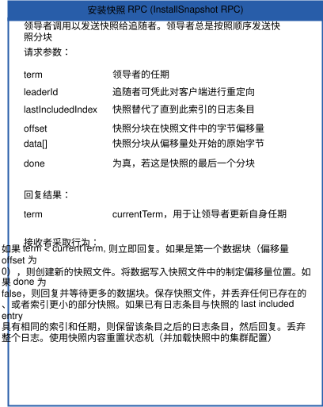

> **图 13**：InstallSnapshot RPC 的总结。快照被分成多个数据块以传输；每个数据块的传输都能向追随者传达存活信号，这样追随者可以重置选举计时器。

这种快照方法偏离了 Raft 的强领导者原则，因为追随者可以在领导者不知情的情况下拍摄快照。然而，我们认为这种偏离是合理的。虽然拥有领导者有助于避免在达成共识时做出冲突的决定，但在拍摄快照时共识已经达成，所以不会有决定冲突。数据仍然只从领导者流向追随者，只是现在追随者可以重新组织它们的数据。

我们考虑了一种替代的基于领导者的方法，即只有领导者创建快照，然后将其发送给每个追随者。然而，这有两个缺点。首先，向每个追随者发送快照会浪费网络带宽并减慢快照过程。每个追随者已经有产生自己快照所需的信息，而且服务器从本地状态产生快照通常比通过网络发送和接收一个要便宜得多。其次，领导者的实现会更复杂。例如，领导者需要一边向追随者复制新的日志条目，一边向它们发送快照，以免阻塞新的客户端请求。

还有两个影响快照性能的问题。首先，服务器必须决定何时拍摄快照。如果服务器过于频繁地快照，会浪费磁盘带宽和能源；如果不够频繁，则有耗尽存储容量的风险，并增加重启期间重放日志所需的时间。一个简单的策略是当日志达到固定的字节大小时拍摄快照。如果将此大小设置为明显大于快照的预期大小，那么快照的磁盘带宽开销就会很小。

其次，写入快照可能需要大量时间，我们不希望这延迟正常操作。解决方案是使用写时复制（copy-on-write）技术，以便可以在不影响正在写入的快照的情况下接受新的更新。例如，用函数式数据结构构建的状态机天然支持这一点。或者，操作系统的写时复制支持（例如 Linux 上的 fork）可用于创建整个状态机的内存快照（我们的实现使用了这种方法）。

增量式的压缩方法，如日志清理（log cleaning）[36] 和日志结构合并树（log-structured merge trees）[30,5]，也是可能的。它们一次只处理一部分数据，因此将压缩负载随时间更均匀地分散。它们首先选择一块累积了许多已删除和已覆盖对象的数据区域，然后以更紧凑的方式重写该区域中的活动对象并释放该区域。与快照相比，这需要显著的额外机制和复杂性，而快照通过始终对整个数据集操作来简化问题。虽然日志清理需要修改 Raft，但状态机可以使用与快照相同的接口来实现 LSM 树。

## 8 客户端交互

本节描述客户端如何与 Raft 交互，包括客户端如何找到集群领导者，以及 Raft 如何支持可线性化（linearizable）语义 [10]。这些问题适用于所有基于共识的系统，Raft 的解决方案与其他系统类似。

Raft 的客户端将它们所有的请求发送给领导者。当客户端首次启动时，它连接到一个随机选择的服务器。如果客户端的第一选择不是领导者，该服务器将拒绝客户端的请求，并提供它所听过的关于最新领导者的信息（AppendEntries 请求包含领导者的网络地址）。如果领导者崩溃，客户端请求将超时；然后客户端用随机选择的服务器重试。

我们对 Raft 的目标是实现了可线性化语义（每个操作看起来都恰好在它的调用和响应之间的某个时刻执行一次）。然而，到目前为止描述的 Raft 可以多次执行一个命令：例如，如果领导者在提交日志条目之后、但在响应客户端之前崩溃，客户端将用新领导者重试该命令，导致它被第二次执行。解决方案是客户端给每个命令分配唯一的序列号。然后，状态机跟踪为每个客户端处理的最新序列号，以及关联的响应。如果它收到一个序列号已经执行过的命令，它会立即响应，而不重新执行该请求。

只读操作可以在不写入任何日志的情况下处理。然而，如果没有额外的措施，这将面临返回陈旧数据的风险，因为响应请求的领导者可能已经被它所不知道的更新领导者取代。可线性化的读取绝不能返回陈旧数据，Raft 需要两个额外的预防措施来保证这一点而不使用日志。首先，领导者必须拥有关于哪些条目已提交的最新信息。领导者完整性性质保证领导者拥有所有已提交的条目，但在其任期开始时，它可能不知道哪些是已提交的。为了找出答案，它需要提交一个来自其任期的条目。Raft 的处理方式是让每个领导者在其任期开始时向日志提交一个空白的无操作（no-op）条目。其次，领导者必须在处理只读请求之前检查它是否已被废黜（如果已经选出了更新的领导者，它的信息可能已陈旧）。Raft 的处理方式是让领导者在响应只读请求之前与集群多数派交换心跳消息。或者，领导者可以依赖心跳机制来提供一种租约（lease）[9] 的形式，但这将依赖时间来保证安全（它假设有界的时钟偏移）。

## 9 实现与评估

我们已经将 Raft 实现为存储 RAMCloud [33] 配置信息并协助 RAMCloud 协调者故障转移的复制状态机的一部分。Raft 实现包含大约 2000 行 C++ 代码，不包括测试、注释或空行。源代码是自由可获取的 [23]。还有大约 25 个独立的第三方开源 Raft 实现 [34]，处于不同的开发阶段，基于本文的草稿。此外，各家公司在部署基于 Raft 的系统 [34]。

本节余下部分使用三个标准评估 Raft：可理解性、正确性和性能。

### 9.1 可理解性

为了衡量 Raft 相对于 Paxos 的可理解性，我们进行了一项实验研究，对象是斯坦福大学高级操作系统课程和加州大学伯克利分校分布式计算课程的高年级本科生和研究生。我们录制了 Raft 和 Paxos 的视频讲座，并制作了相应的测验。Raft 讲座涵盖了本文的内容（日志压缩除外）；Paxos 讲座涵盖了足够多的材料以创建等价的复制状态机，包括单决议 Paxos、多决议 Paxos、重新配置，以及实践中需要的一些优化（如领导者选举）。测验测试对算法的基本理解，也要求学生推理边界情况。每个学生先看一个视频，做相应的测验，再看第二个视频，做第二个测验。大约一半参与者先做 Paxos 部分，另一半先做 Raft 部分，以说明个人表现差异和从研究第一部分获得的经验。我们比较参与者在每个测验上的分数，以确定参与者是否表现出对 Raft 更好的理解。

我们试图使 Paxos 与 Raft 的比较尽可能公平。实验以两种方式偏向 Paxos：43 名参与者中有 15 人报告说有一些 Paxos 的先验经验，而且 Paxos 视频比 Raft 视频长 14%。如表 1 所总结，我们已采取措施减轻潜在的偏见来源。我们的所有材料都可审阅 [28,31]。

| 偏见顾虑       | 为抵消偏见所采取的步骤                                             | 可供审阅的材料 [28,31] |
|------------|---------------------------------------------------------|-----------------|
| **讲座质量相等** | 两种算法由同一讲师讲授。Paxos 讲座基于并改进自多所大学使用的现有材料（但 Paxos 讲座长 14%）。 | 视频              |
| **测验难度相等** | 问题按难度分组，并在两份试卷间配对。                                      | 测验              |
| **公平评分**   | 使用评分量规（rubric）。以随机顺序评分，在两份测验间交替。                        | 量规              |

> **表 1**：研究中可能对 Paxos 存在的偏见顾虑、为抵消每种偏见所采取的步骤，以及可供审阅的额外材料。

平均而言，参与者在 Raft 测验上的得分比 Paxos 测验高 4.9 分（满分 60 分，Raft 平均分为 25.7，Paxos 为 20.8）；图 14 显示了他们的个人分数。配对 t 检验表明，在 95% 置信度下，Raft 分数的真实分布均值至少比 Paxos 分数的真实分布大 2.5 分。

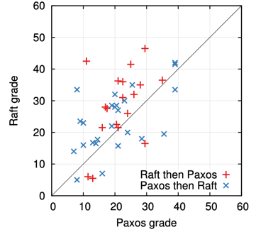

> **图 14**：比较 43 名参与者在 Raft 和 Paxos 测验上表现的散点图。位于对角线上方的点（33 个）代表在 Raft 上得分更高的参与者。

我们还创建了一个线性回归模型，根据三个因素预测新学生的测验分数：他们参加的测验、他们先前的 Paxos 经验程度，以及他们学习算法的顺序。该模型预测测验的选择会产生 12.5 分有利于 Raft 的差异。这显著高于观察到的 4.9 分差异，因为许多实际学生有 Paxos 先验经验，这对 Paxos 帮助很大，而对 Raft 帮助略少。奇怪的是，该模型还预测已经参加过 Paxos 测验的人 Raft 分数低 6.3 分；虽然我们不知道原因，但这似乎是统计显著的。

我们还在测验后调查了参与者，看他们认为哪种算法更容易实现或解释；结果如图 15 所示。绝大多数参与者报告说 Raft 更容易实现和解释（每个问题都是 41 人中的 33 人）。然而，这些自我报告的感觉可能不如参与者的测验分数可靠，并且参与者可能受到我们关于 Raft 更易理解的假设的影响。

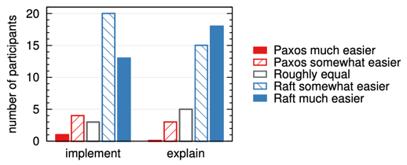

> **图 15**：使用 5 点量表，参与者被问到（左）他们认为哪种算法在构建功能正确且高效的系统中更容易实现，（右）哪种更容易向一名计算机科学研究生解释。

关于 Raft 用户研究的详细讨论见 [31]。

### 9.2 正确性

我们已经为第 5 节描述的共识机制开发了形式化规定和安全性证明。形式化规定 [31] 使用 TLA+ 规定语言 [17] 使图 2 中总结的信息完全精确。它大约 400 行长，并作为证明的对象。它对任何实现 Raft 的人也自有其用处。我们已经使用 TLA 证明系统 [7] 机械地证明了**日志完整性**（Log Completeness）性质。然而，这个证明依赖于尚未机械检查的不变式（例如，我们尚未证明规定的类型安全）。此外，我们还写了一个状态机安全性性质的非形式化证明 [31]，它是完整的（它仅依赖于规定）并且相对精确（大约 3500 词）。

### 9.3 性能

Raft 的性能与其他共识算法（如 Paxos）相似。性能最重要的情况是已确立的领导者正在复制新的日志条目。Raft 使用最少的消息数（从领导者到集群一半的一轮往返）来实现这一点。也有可能进一步提高 Raft 的性能。例如，它很容易支持批处理（batching）和流水线（pipelining）请求以获得更高吞吐量和更低延迟。文献中已为其他算法提出了各种优化；其中许多可以应用到 Raft，但我们留作未来工作。

我们使用我们的 Raft 实现来测量 Raft 领导者选举算法的性能，并回答两个问题。第一，选举过程能快速收敛吗？第二，领导者崩溃后能达到的最小停机时间是多少？

为了测量领导者选举，我们反复让五台服务器集群的领导者崩溃，并计时检测和崩溃并选出新领导者所需的时间（见图 16）。为了产生最坏情况场景，每次试验中的服务器具有不同的日志长度，所以一些候选者没有资格成为领导者。此外，为了鼓励选票分裂，我们的测试脚本在终止领导者进程之前触发了来自领导者的心跳 RPC 的同步广播（这近似了领导者在崩溃前复制新日志条目的行为）。领导者在其心跳间隔内均匀随机地崩溃，心跳间隔是所有试验最小选举超时的一半。因此，最小可能的停机时间约为最小选举超时的一半。

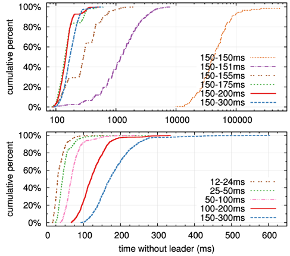

> **图 16**：检测和替换崩溃领导者的时间。上方的图改变了选举超时中的随机化程度，下方的图缩放了最小选举超时。每条线代表 1000 次试验（"150–150ms" 为 100 次），对应于一种特定的选举超时选择；例如 "150–155ms" 表示选举超时在 150ms 和 155ms 之间均匀随机选取。测量在一个五台服务器的集群上进行，广播时间约为 15ms。九台服务器集群的结果类似。

图 16 上方的图显示，选举超时中少量的随机化就足以避免选举中的选票分裂。在没有随机化的情况下，由于许多选票分裂，我们的测试中领导者选举持续花费超过 10 秒。仅添加 5ms 随机化就有显著帮助，导致中位停机时间为 287ms。使用更多随机化改善了最坏情况行为：有 50ms 随机化时，最坏情况完成时间（超过 1000 次试验）为 513ms。

图 16 下方的图显示，可以通过减少选举超时来减少停机时间。对于 12–24ms 的选举超时，选出一个领导者平均只需 35ms（最长的试验花了 152ms）。然而，将超时降低到这一点以下违反了 Raft 的时间要求：领导者在其他服务器开始新选举之前难以广播心跳。这可能导致不必要的领导者变更并降低整体系统可用性。我们建议使用保守的选举超时，如 150–300ms；这样的超时不太可能引起不必要的领导者变更，并且仍将提供良好的可用性。

## 10 相关工作

关于共识算法已有大量文献，许多属于以下类别之一：

- Lamport 对 Paxos 的原始描述 [15]，以及试图更清楚地解释它的尝试 [16,20,21]。
- Paxos 的详述，填补缺失的细节并修改算法以提供更好的实现基础 [26,39,13]。
- 实现共识算法的系统，如 Chubby [2,4]、ZooKeeper [11,12] 和 Spanner [6]。Chubby 和 Spanner 的算法尚未详细发表，尽管两者都声称基于 Paxos。ZooKeeper 的算法已更详细地发表，但它与 Paxos 很不同。
- 可应用于 Paxos 的性能优化 [18,19,3,25,1,27]。
- Oki 和 Liskov 的 Viewstamped Replication (VR)，一种与 Paxos 大致同期开发的共识替代方法。原始描述 [29] 与分布式事务协议交织在一起，但核心共识协议已在最近的更新 [22] 中分离出来。VR 使用基于领导者的方法，与 Raft 有许多相似之处。

Raft 与 Paxos 最大的区别在于 Raft 的强领导力：Raft 使用领导者选举作为共识协议的重要组成部分，并将尽可能多的功能集中在领导者身上。这种方法产生了一个更简单、更易理解的算法。例如，在 Paxos 中，领导者选举与基本共识协议是正交的：它仅作为性能优化，并不是达成共识所必需的。然而，这导致了额外的机制：Paxos 既包含用于基本共识的两阶段协议，也包含用于领导者选举的单独机制。相比之下，Raft 将领导者选举直接纳入共识算法，并将其用作共识的两个阶段中的第一个。这导致比 Paxos 更少的机制。

像 Raft 一样，VR 和 ZooKeeper 都是基于领导者的，因此也共享 Raft 相对于 Paxos 的许多优势。然而，Raft 比 VR 或 ZooKeeper 有更少的机制，因为它最小化了非领导者的功能。例如，Raft 中的日志条目只朝一个方向流动：在 AppendEntries RPC 中从领导者向外流出。在 VR 中日志条目双向流动（领导者在选举过程中可以接收日志条目）；这导致了额外的机制和复杂性。已发表的 ZooKeeper 的描述说明了其中领导者也双向传输日志条目，但实现显然更像 Raft [35]。

Raft 的消息类型比我们所知的其他任何基于共识的日志复制算法都少。例如，我们统计了 VR 和 ZooKeeper 用于基本共识和成员变更的消息类型数（不包括日志压缩和客户端交互，因为这些几乎与算法无关）。VR 和 ZooKeeper 各定义了 10 种不同的消息类型，而 Raft 只有 4 种消息类型（两个 RPC 请求及其响应）。Raft 的消息比其他算法的稍微密集一些，但总体上更简单。此外，VR 和 ZooKeeper 被描述为在领导者变更期间传输整个日志；需要额外的消息类型来优化这些机制，使它们实用。

Raft 的强领导力方法简化了算法，但它排除了一些性能优化。例如，平等主义 Paxos（EPaxos）在无领导者的方法下在某些条件下可以实现更高性能 [27]。EPaxos 利用了状态机命令的可交换性。任何服务器只要其他并发提出的命令与它可交换，就可以用仅一轮通信提交一个命令。然而，如果并发提出的命令彼此不可交换，EPaxos 需要额外一轮通信。因为任何服务器都可以提交命令，EPaxos 在服务器之间很好地平衡负载，并能在广域网设置中实现比 Raft 更低的延迟。然而，它给 Paxos 增加了显著的复杂性。

对于集群成员变更，其他工作中已经提出或实现了几种不同的方法，包括 Lamport 的原始提议 [15]、VR [22] 和 SMART [24]。我们为 Raft 选择了联合共识方法，因为它利用了共识协议的其余部分，因此成员变更只需要非常少的额外机制。Lamport 的基于 α 的方法对 Raft 不可行，因为它假设可以在没有领导者的情况下达成共识。与 VR 和 SMART 相比，Raft 的重新配置算法有一个优势，即成员变更可以在不限制正常请求处理的情况下发生；相比之下，VR 在配置变更期间停止所有正常处理，而 SMART 对未完成请求的数量施加了类似 α 的限制。Raft 的方法还使得在配置变更期间继续处理请求成为可能，因为联合共识允许两个配置同时处于活动状态。

## 11 结论

算法在设计时通常以正确性、效率和/或简洁性为主要目标。尽管这些都是值得追求的目标，但我们认为可理解性同样重要。在开发者将算法转化为实际实现之前，其他目标都无法实现，而实际实现会无可避免地在已发表的形式基础上偏离且有所扩展。除非开发者对算法有深入的理解并能建立关于它的直觉，否则他们很难在各自的实现中保留其期望的性质。

在本文中，我们探讨了分布式共识这一难题，其中被广泛接受却难以参透的算法 Paxos 多年来一直困扰着学生和开发者。我们开发了一种新算法 Raft，并已证明它比 Paxos 更易于理解。我们也相信 Raft 为系统构建提供了更好的基础。以可理解性作为主要设计目标改变了我们设计 Raft 的方式；随着设计的推进，我们发现自己反复重用少数几种技术，例如分解问题并简化状态空间。这些技术不仅提高了 Raft 的可理解性，也使我们更容易说服自己相信它的正确性。

## 致谢

这项用户研究得以开展，离不开 Ali Ghodsi、David Mazières 以及加州大学伯克利分校 CS 294-91 课程和斯坦福大学 CS 240 课程全体学生的支持。Scott Klemmer 协助我们设计了用户研究，Nelson Ray 在统计分析方面给予了指导。用户研究中使用的 Paxos 幻灯片大量借用了 Lorenzo Alvisi 最初制作的幻灯片。特别感谢 David Mazières 和 Ezra Hoch 为 Raft 找出了一些细微的 bug。许多人为本文及用户研究材料提供了有益的反馈，包括 Ed Bugnion、Michael Chan、Hugues Evrard、Daniel Giffin、Arjun Gopalan、Jon Howell、Vimalkumar Jeyakumar、Ankita Kejriwal、Aleksandar Kracun、Amit Levy、Joel Martin、Satoshi Matsushita、Oleg Pesok、David Ramos、Robbert van Renesse、Mendel Rosenblum、Nicolas Schiper、Deian Stefan、Andrew Stone、Ryan Stutsman、David Terei、Stephen Yang、Matei Zaharia、24 位匿名会议审稿人（含重复），以及尤其要感谢我们的 shepherd Eddie Kohler。Werner Vogels 在推特上转发了早期草稿的链接，为 Raft 带来了显著的关注度。本工作得到以下机构的支持：Gigascale Systems Research Center 与 Multiscale Systems Center（Focus Center Research Program 资助的六个研究中心中的两个，该计划由 Semiconductor Research Corporation 管理）、STARnet（由 MARCO 和 DARPA 赞助的 Semiconductor Research Corporation 计划）、美国国家科学基金会（Grant No. 0963859），以及 Facebook、Google、Mellanox、NEC、NetApp、SAP 和 Samsung 的资助。Diego Ongaro 受 The Junglee Corporation Stanford Graduate Fellowship 资助。

## 参考文献

[1] BOLOSKY, W. J., BRADSHAW, D., HAAGENS, R. B., KUSTERS, N. P., AND LI, P. Paxos replicated state machines as the basis of a high-performance data store. In *Proc. NSDI'11, USENIX Conference on Networked Systems Design and Implementation* (2011), USENIX, pp. 141–154.

[2] BURROWS, M. The Chubby lock service for loosely-coupled distributed systems. In *Proc. OSDI'06, Symposium on Operating Systems Design and Implementation* (2006), USENIX, pp. 335–350.

[3] CAMARGOS, L. J., SCHMIDT, R. M., AND PEDONE, F. Multicoordinated Paxos. In *Proc. PODC'07, ACM Symposium on Principles of Distributed Computing* (2007), ACM, pp. 316–317.

[4] CHANDRA, T. D., GRIESEMER, R., AND REDSTONE, J. Paxos made live: an engineering perspective. In *Proc. PODC'07, ACM Symposium on Principles of Distributed Computing* (2007), ACM, pp. 398–407.

[5] CHANG, F., DEAN, J., GHEMAWAT, S., HSIEH, W. C., WALLACH, D. A., BURROWS, M., CHANDRA, T., FIKES, A., AND GRUBER, R. E. Bigtable: a distributed storage system for structured data. In *Proc. OSDI'06, USENIX Symposium on Operating Systems Design and Implementation* (2006), USENIX, pp. 205–218.

[6] CORBETT, J. C., DEAN, J., EPSTEIN, M., FIKES, A., FROST, C., FURMAN, J. J., GHEMAWAT, S., GUBAREV, A., HEISER, C., HOCHSCHILD, P., HSIEH, W., KANTHAK, S., KOGAN, E., LI, H., LLOYD, A., MELNIK, S., MWAURA, D., NAGLE, D., QUINLAN, S., RAO, R., ROLIG, L., SAITO, Y., SZYMANIAK, M., TAYLOR, C., WANG, R., AND WOODFORD, D. Spanner: Google's globally-distributed database. In *Proc. OSDI'12, USENIX Conference on Operating Systems Design and Implementation* (2012), USENIX, pp. 251–264.

[7] COUSINEAU, D., DOLIGEZ, D., LAMPORT, L., MERZ, S., RICKETTS, D., AND VANZETTO, H. TLA+ proofs. In *Proc. FM'12, Symposium on Formal Methods* (2012), D. Giannakopoulou and D. Méry, Eds., vol. 7436 of *Lecture Notes in Computer Science*, Springer, pp. 147–154.

[8] GHEMAWAT, S., GOBIOFF, H., AND LEUNG, S.-T. The Google file system. In *Proc. SOSP'03, ACM Symposium on Operating Systems Principles* (2003), ACM, pp. 29–43.

[9] GRAY, C., AND CHERITON, D. Leases: An efficient fault-tolerant mechanism for distributed file cache consistency. In *Proceedings of the 12th ACM Symposium on Operating Systems Principles* (1989), pp. 202–210.

[10] HERLIHY, M. P., AND WING, J. M. Linearizability: a correctness condition for concurrent objects. *ACM Transactions on Programming Languages and Systems* 12 (July 1990), 463–492.

[11] HUNT, P., KONAR, M., JUNQUEIRA, F. P., AND REED, B. ZooKeeper: wait-free coordination for internet-scale systems. In *Proc ATC'10, USENIX Annual Technical Conference* (2010), USENIX, pp. 145–158.

[12] JUNQUEIRA, F. P., REED, B. C., AND SERAFINI, M. Zab: High-performance broadcast for primary-backup systems. In *Proc. DSN'11, IEEE/IFIP Int'l Conf. on Dependable Systems & Networks* (2011), IEEE Computer Society, pp. 245–256.

[13] KIRSCH, J., AND AMIR, Y. Paxos for system builders. Tech. Rep. CNDS-2008-2, Johns Hopkins University, 2008.

[14] LAMPORT, L. Time, clocks, and the ordering of events in a distributed system. *Communications of the ACM* 21, 7 (July 1978), 558–565.

[15] LAMPORT, L. The part-time parliament. *ACM Transactions on Computer Systems* 16, 2 (May 1998), 133–169.

[16] LAMPORT, L. Paxos made simple. *ACM SIGACT News* 32, 4 (Dec. 2001), 18–25.

[17] LAMPORT, L. *Specifying Systems, The TLA+ Language and Tools for Hardware and Software Engineers*. Addison-Wesley, 2002.

[18] LAMPORT, L. Generalized consensus and Paxos. Tech. Rep. MSR-TR-2005-33, Microsoft Research, 2005.

[19] LAMPORT, L. Fast paxos. *Distributed Computing* 19, 2 (2006), 79–103.

[20] LAMPSON, B. W. How to build a highly available system using consensus. In *Distributed Algorithms*, O. Baboaglu and K. Marzullo, Eds. Springer-Verlag, 1996, pp. 1–17.

[21] LAMPSON, B. W. The ABCD's of Paxos. In *Proc. PODC'01, ACM Symposium on Principles of Distributed Computing* (2001), ACM, pp. 13–13.

[22] LISKOV, B., AND COWLING, J. Viewstamped replication revisited. Tech. Rep. MIT-CSAIL-TR-2012-021, MIT, July 2012.

[23] LogCabin source code. http://github.com/logcabin/logcabin.

[24] LORCH, J. R., ADYA, A., BOLOSKY, W. J., CHAIKEN, R., DOUCEUR, J. R., AND HOWELL, J. The SMART way to migrate replicated stateful services. In *Proc. EuroSys'06, ACM SIGOPS/EuroSys European Conference on Computer Systems* (2006), ACM, pp. 103–115.

[25] MAO, Y., JUNQUEIRA, F. P., AND MARZULLO, K. Mencius: building efficient replicated state machines for WANs. In *Proc. OSDI'08, USENIX Conference on Operating Systems Design and Implementation* (2008), USENIX, pp. 369–384.

[26] MAZIÈRES, D. Paxos made practical. http://www.scs.stanford.edu/~dm/home/papers/paxos.pdf, Jan. 2007.

[27] MORARU, I., ANDERSEN, D. G., AND KAMINSKY, M. There is more consensus in egalitarian parliaments. In *Proc. SOSP'13, ACM Symposium on Operating System Principles* (2013), ACM.

[28] Raft user study. http://ramcloud.stanford.edu/~ongaro/userstudy/.

[29] OKI, B. M., AND LISKOV, B. H. Viewstamped replication: A new primary copy method to support highly-available distributed systems. In *Proc. PODC'88, ACM Symposium on Principles of Distributed Computing* (1988), ACM, pp. 8–17.

[30] O'NEIL, P., CHENG, E., GAWLICK, D., AND ONEIL, E. The log-structured merge-tree (LSM-tree). *Acta Informatica* 33, 4 (1996), 351–385.

[31] ONGARO, D. *Consensus: Bridging Theory and Practice*. PhD thesis, Stanford University, 2014 (work in progress).

[32] ONGARO, D., AND OUSTERHOUT, J. In search of an understandable consensus algorithm. In *Proc ATC'14, USENIX Annual Technical Conference* (2014), USENIX.

[33] OUSTERHOUT, J., AGRAWAL, P., ERICKSON, D., KOZYRAKIS, C., LEVERICH, J., MAZIÈRES, D., MITRA, S., NARAYANAN, A., ONGARO, D., PARULKAR, G., ROSENBLUM, M., RUMBLE, S. M., STRATMANN, E., AND STUTSMAN, R. The case for RAMCloud. *Communications of the ACM* 54 (July 2011), 121–130.

[34] Raft consensus algorithm website. http://raftconsensus.github.io.

[35] REED, B. Personal communications, May 17, 2013.

[36] ROSENBLUM, M., AND OUSTERHOUT, J. K. The design and implementation of a log-structured file system. *ACM Trans. Comput. Syst.* 10 (February 1992), 26–52.

[37] SCHNEIDER, F. B. Implementing fault-tolerant services using the state machine approach: a tutorial. *ACM Computing Surveys* 22, 4 (Dec. 1990), 299–319.

[38] SHVACHKO, K., KUANG, H., RADIA, S., AND CHANSLER, R. The Hadoop distributed file system. In *Proc. MSST'10, Symposium on Mass Storage Systems and Technologies* (2010), IEEE Computer Society, pp. 1–10.

[39] VAN RENESSE, R. Paxos made moderately complex. Tech. rep., Cornell University, 2012.
